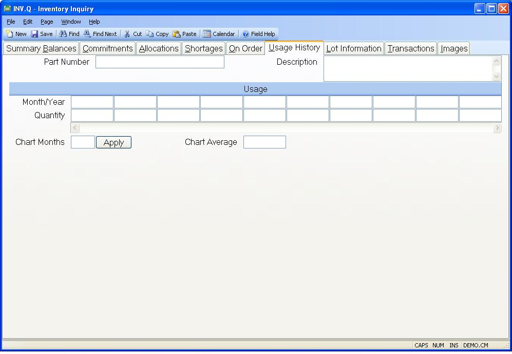

##  Inventory Inquiry (INV.Q)

<PageHeader />

##  Usage History

**Month/Year** Contains the month and year in which the associated quantity of
the part was used.  
  
**Quantity** Contains the quantity of the part used in the associated month-
year period.  
  
**Part Number** The part number whose usage information is being displayed.  
  
**Usage Chart** Displays a chart of the historical usage. You may right click
this chart to display it in its own window where it can be resized for better
viewing if required.  
  
**Chart Months** The field controls the number of months that are displayed in the usage chart. The number of months initially loaded into this field for you is 12 unless there have been fewer than 12 months of usage for the part. Please note that the the total number of months the system will track usage on for any part is defined in [ INV.CONTROL ](../../../../../../../../../../rover/AP-OVERVIEW/AP-ENTRY/AP-E/AP-E-2/INV-CONTROL) . Therefore, a number should not be entered that is greater than the number entered in [ INV.CONTROL ](../../../../../../../../../../rover/AP-OVERVIEW/AP-ENTRY/AP-E/AP-E-2/INV-CONTROL) .   
  
**Apply** Click this button to apply the chart months specified.  
  
**Chart Average** Displays the average monthly usage for the periods being
displayed in the chart.  
  
**Description** Contains the description of the part number selected.  
  
  
<badge text= "Version 8.10.57" vertical="middle" />

<PageFooter />