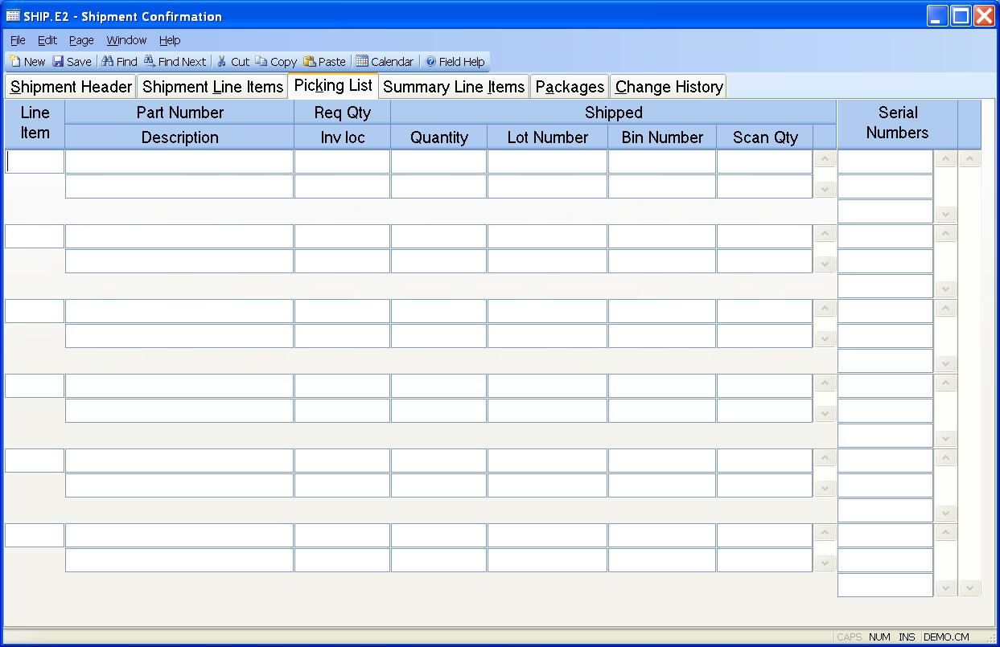

##  Shipment Confirmation (SHIP.E2)

<PageHeader />

##  Picking List

**Pick.Li** The number of the line item to be shipped.  
  
**Pick.Part** The part number to be pulled.  
  
**Part Description** The description of the associated part from the parts
master, or the description of a  
non-inventory item.  
  
**Pick.Ship Qty** The quantity that is to be shipped of the item.  
  
**Pick Location** The location from which the item will be pulled for
shipment.  
  
**Pick.Qty Pulled** Enter the quantity of the item pulled for  
  
**Pick.Lot Number** Enter the lot number associated with the quantity pulled
if the item is lot controlled.  
  
**Bin** This field contains the bin number from which the material was pulled
for this shipment.  
  
**Scan Qty** This field contains the quantity that has been scanned and is
used for comparison with the pull quantity to verify the correct quantity has
been scanned.  
  
**Pick.Serial.No** Enter any serial numbers associated with the item being
shipped.  
  
  
<badge text= "Version 8.10.57" vertical="middle" />

<PageFooter />