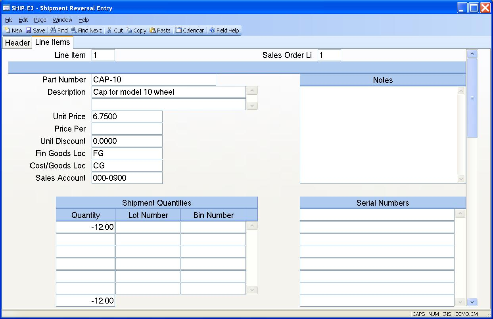

##  Shipment Reversal Entry (SHIP.E3)

<PageHeader />

##  Line Items

**Line Item#** The line number of the part to be shipped as it appears on the
original shipment.  
  
**Sales Order Li#** The sales order line item from the original shipment.  
  
**Part Number** Contains the part number from the original shipment.  
  
**Description** The description is loaded from the sales order for the sales
order line entered.  
  
**Unit Price** Contains the unit price of the items from the original
shipment.  
  
**Price Per** Contains the unit price of the items from the original shipment.  
  
**Unit Discount** Contains the unit discount of the items from the Original
shipment.  
  
**Fin Goods Loc** Contains the inventory location from which the items were
relieved on the original shipment. The items will be returned to this location
when the record is filed.  
  
**Cost/Goods Loc** Contains the cost of goods location from the original
shipment record which will be used in the reversal transaction.  
  
**Sales Account#** Contains the sales account number from the original
shipment record to be used in the reversal transaction.  
  
**Lot Qty** Contains the quantity of the associated lot to be reversed.  
  
**Lot No** Contains the lot numbers shown as shipped for the item.  
  
**Bin** This field contains the bin number from which the material was
originally pulled.  
  
**Quantity** Contains the quantity from the original shipment shown as a
negative number.  
  
**Line Notes** The line notes are defaulted from the original shipment record,
but may be changed to explain the reason for the reversal if required.  
  
**Serial Numbers** Contains all of the serial numbers entered on the orginal
shipment.  
  
  
<badge text= "Version 8.10.57" vertical="middle" />

<PageFooter />