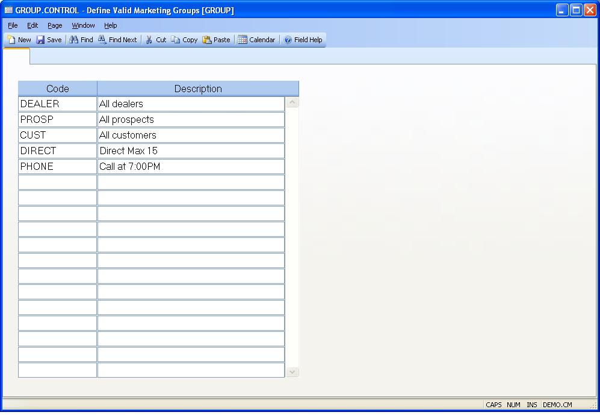

##  Define Valid Marketing Groups (GROUP.CONTROL)

<PageHeader />

##

**Control ID** The control id is the company code (as defined on screen 2 of
CO.CONTROL) preceded by "MRK". If you only have one company code the control
id will automatically be inserted into this procedure for you. If you have
multiple company codes you may select from a list of available companies or
you may enter the id directly e.g. MRK2. This record contains the default
information used in the MRK module by company code.  
  
**Code** Group codes are used in the customer and prospect master files to
group companies based on various criteria. More than one group code may be
assigned to a given customer or prospect. Enter the group codes that may be
assigned in this field.  
  
**Description** Enter a description for the corresponding group code.  
  
  
<badge text= "Version 8.10.57" vertical="middle" />

<PageFooter />