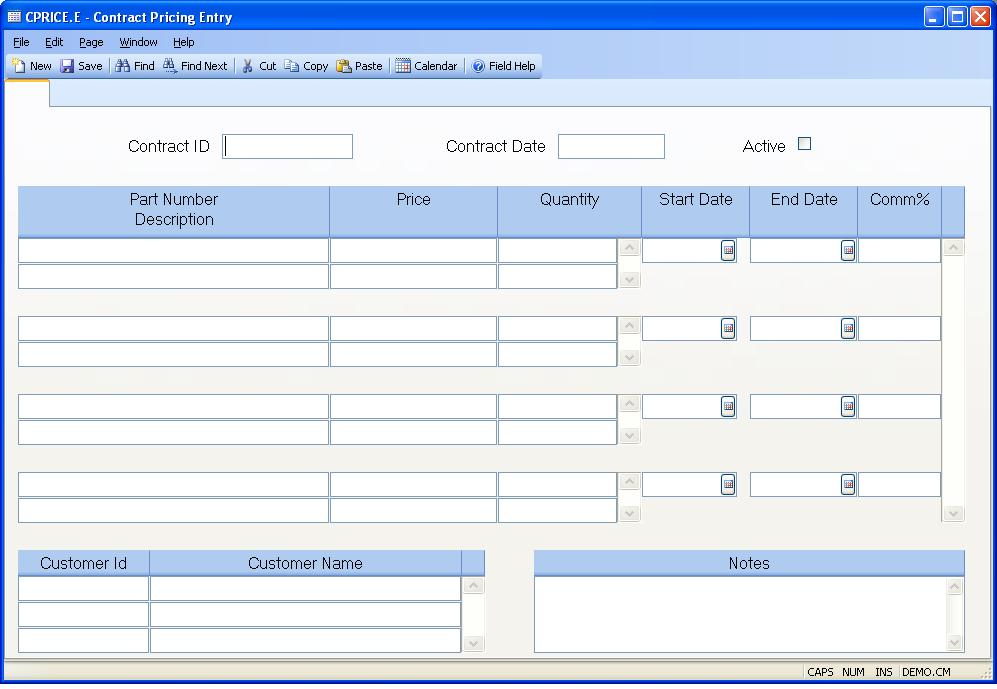

##  Contract Pricing Entry (CPRICE.E)

<PageHeader />

##

**CONTRACT.ID** Enter the contract ID or leave blank to allow the system to assign the next sequential number for the contract ID. This contract ID can be associated to one or more customers using this procedure or via entry in [ CUST.E ](../../../../../../../../../../rover/AP-OVERVIEW/AP-ENTRY/ACCT-CONTROL/ACCT-CONTROL-1/ar-e/CUST-E) . Then the contract pricing will be applied when a sales order is entered for the customer or when a price is calculated for a part number, such as in the configurator.   
  
**Date** The date the contract was entered into the system. This is defaulted
to the current date for new contracts and cannot be changed.  
  
**Active?** Check the box if the contract is active. If not active, leave the
box unchecked. Inactive contracts will not be used in part pricing.  
  
**Part No** Enter the part number that the pricing information will be applied
to.  
  
**Price** Enter the contract price that applies to the part number.  
  
**Qty** Enter the quantity break for the associated price .The associated
price will be used when the quantity ordered is less than or equal to the
quantity entered in this field.  
  
**Start Date** Enter the start effectivity date for this part number and
contract price. If no date is entered, then the price is assumed to be in
effect as of the current date.  
  
**End Date** Enter the end effectivity date for this part number and contract
price. If no date is entered, then the price is assumed to be valid
indefinitely.  
  
**Comm Pct** Enter the commission percent that will be applied for this part
and price. If no commission percent is entered, then the standard rep
commission will be used in the sales order.  
  
**Part Description** This field displays the part description for information
only.  
  
**Cust Id** Enter the customer number(s) that this contract will apply to. This will update the customer record also. The contracts that apply to the customer can be updated on [ CUST.E ](../../../../../../../../../../rover/AP-OVERVIEW/AP-ENTRY/ACCT-CONTROL/ACCT-CONTROL-1/ar-e/CUST-E) and viewed on [ CUST.Q ](../../../../../../../../../../rover/AP-OVERVIEW/AP-ENTRY/ACCT-CONTROL/ACCT-CONTROL-1/CUST-Q) .   
  
**Cust Name** The customer name associated with the customer ID entered is
displayed here for information only.  
  
**Notes** Enter any notes applicable to this contract.  
  
  
<badge text= "Version 8.10.57" vertical="middle" />

<PageFooter />