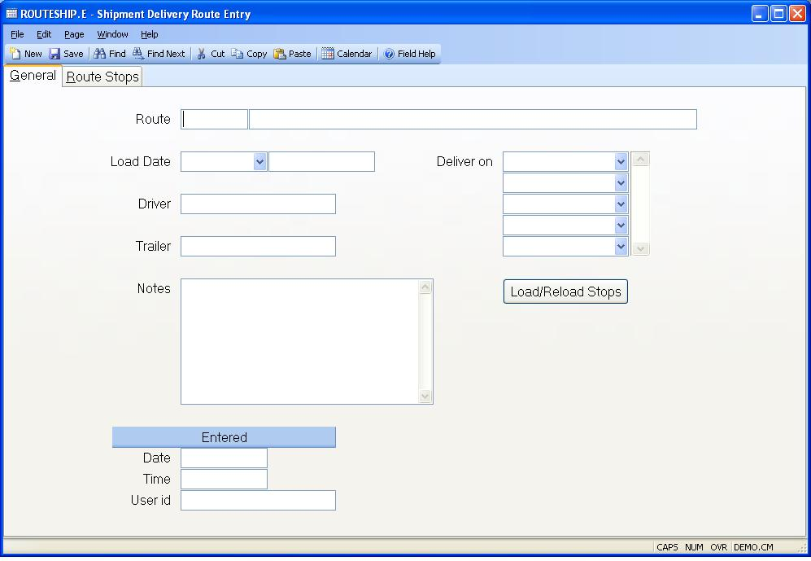

##  Shipment Delivery Route Entry (ROUTESHIP.E)

<PageHeader />

##  General

** ** The ID for the routeship record will be system assigned using the route#
and delivery date. It does not appear on the screen. The format of the record
ID is ROUTE*DATE.  
  
**Route Id** Enter the master route number for this shipment delivery route.
If it exists as a valid route, data will be defaulted from the route;
otherwise the description and other information will need to be entered
manually. Use the special help options to lookup existing records by route# or
load date.  
  
**Route Description** The delivery route description will be defaulted from
the route record but can be changed when needed, as in the case of special
one-time routes.  
  
**Load Date** Enter the load date for the route. The combination of route ID
and date will be the key to this routeship record. The date entered should be
one of the load dates on the route.  
  
**Load Day** The load day from the route master corresponding to the date
entered. It will be displayed for verification of the date.  
  
**Deliver Day** Enter the delivery days for this route. These will be
defaulted from the route record if the load date entered is defined as a load
day on the route master.  
  
**Driver** Enter the driver for this delivery.  
  
**Trailer** Enter the trailer that will be used for this delivery.  
  
**Notes** Enter any notes pertaining to this delivery.  
  
**Stamp Date** The date this shipment delivery route was created.  
  
**Stamp Time** The time this shipment delivery route was created.  
  
**Stamp User** The userid that entered this shipment delivery route.  
  
**Load/Reload Stops** Click here to load route stop data using data from the
route master. All shipments that are eligible for the customers on the route
for the delivery dates specified will be loaded.  
  
  
<badge text= "Version 8.10.57" vertical="middle" />

<PageFooter />