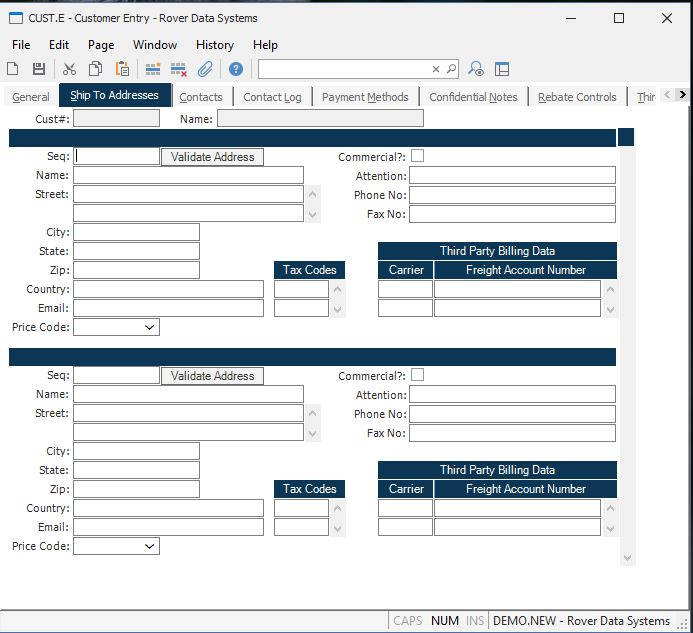

##  Customer Entry (CUST.E)

<PageHeader />

##  Ship To Addresses

**Customer Number** The number assigned to this customer. This field is used
for display purposes only.  
  
**Customer Name** The name of the customer as it appears on screen  
  
**Ship Seq** Enter the sequence id to be assigned to the following shipping
address. A sequence id must be entered before the system will allow you to
enter the shipping address.  
  
**Ship Name** Enter the company name for this sequence number.  
  
**Street Address** Enter the ship street address for this sequence number. Do
not enter the city state and zip in this field.  
  
**Ship City** Enter the city the shipment will be sent to.  
  
**Ship State** Enter the 2 digit state code for the associated address.  
  
**Ship Zip** Enter the zip code for the associated address.  
  
**Ship Country** Enter the country portion of the address information. Please note that you may be required to entrer the country name as it has been entered in the [ SHIP.CONTROL ](../../../../duplicates/SHIP-CONTROL/README.md) procedure. For example, instead of entering U.S.A. you may need to enter United States. If this requirement has been applied to your account, an error message will be displayed if the entry made into this field does not match the entry found in [ ship.control ](../../../../MRK-OVERVIEW/MRK-ENTRY/SHIP-CONTROL/README.md) .   
  
**Ship Email** Enter the email address for this address.  
  
**Commercial Residential** Check this box if this is a commercial address.  
  
**Ship Attn** Enter the name of the person ro contact to whose attention the
shipment should be addressed.  
  
**Ship Phone** Enter the phone number for this sequence number.  
  
**Ship Fax** Enter the fax number for this sequence number.  
  
**Sales Tax Codes** If the associated ship address is subject to sales tax,
enter the sales tax codes to be used.  
  
**Ship Carrier** Enter the freight carrier (e.g. UPS, FEDX) that you wish to
define a default third party account number for. The freight carrier and
account number must have been pre-defined on the THIRD PARTY FREIGHT tab.  
  
**Ship Acct No** Enter the default account number for the associated freight
carrier. When a sales order is entered for this customer and will ship via
this freight carrier, this account number will default into the sales order
record for the user. The account number will pass from the sales order to the
shipper when the freight charges are scheduled to be paid by a third party
(i.e. freight code "T").  
  
  
<badge text= "Version 8.10.57" vertical="middle" />

<PageFooter />