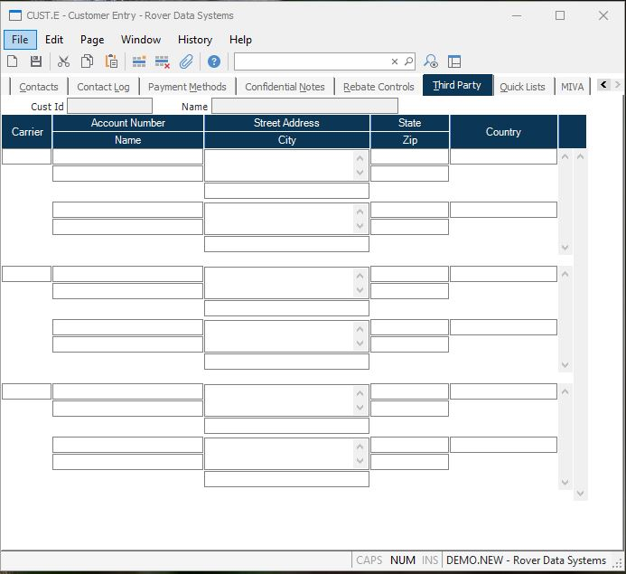

##  Customer Entry (CUST.E)

<PageHeader />

##  Third Party

**Customer** The number assigned to this customer. This field is used for
display purposes only.  
  
**Customer Name** The name of the customer as it appears on screen 1.  
  
**Carrier** Enter the freight carrier you wish to enter third party billing
data.  
  
**Frt Account** If a third party will be billed for freight charges, enter the
account number that the charges should be billed to.  
  
**Third Party** Enter the name of the third party who will be paying for the
freight charges.  
  
**Third Party Street** Enter the street address for the third party.  
  
**Third Party City** Enter the city for the third party.  
  
**Third Party State** Enter the state for the third party.  
  
**Third Party Zip** Enter the zip code for the third party.  
  
**Third Party Country** Enter the country portion of the address information. Please note that you may be required to entrer the country name as it has been entered in the [ SHIP.CONTROL ](../../../../duplicates/SHIP-CONTROL/README.md) procedure. For example, instead of entering U.S.A. you may need to enter United States. If this requirement has been applied to your account, an error message will be displayed if the entry made into this field does not match the entry found in [ ship.control ](../../../../MRK-OVERVIEW/MRK-ENTRY/SHIP-CONTROL/README.md) .   
  
  
<badge text= "Version 8.10.57" vertical="middle" />

<PageFooter />