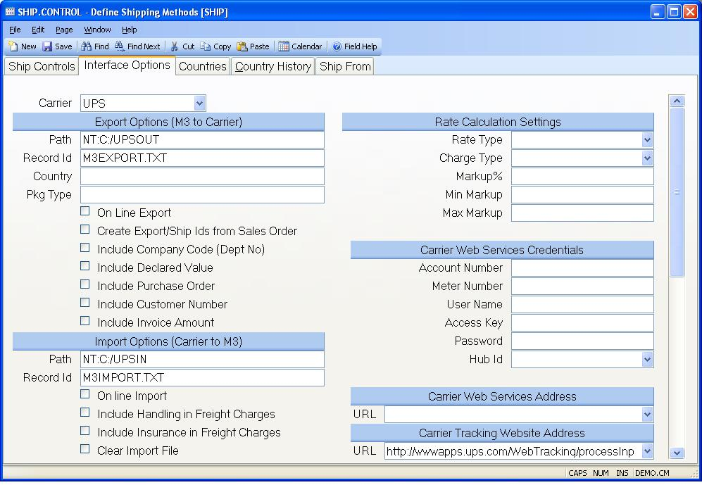

##  Define Shipping Methods (SHIP.CONTROL)

<PageHeader />

##  Interface Options

**Carrier** Select the freight companies you wish to interface with M3.
Services available include shipping rate lookups, address verification and an
interface to the carriers shipping terminal software. In order to begin using
the interface with the carriers shipping terminal an on site visit will be
required by a representative of the carrier.  
  
**Export Path** Enter the export path to be used when sending data to the
freight carrier. Please note that the shipping data that will be exported will
be saved in a text file that can than be loaded into the freight carrier's
software.  
  
**Export Id** Enter the name of the export (i.e. record) id that data will be
written to. This text file will then be read by the freight carrier and
imported into their system.  
  
**Default Country Code** Enter the 2 digit carrier code for the country which
should be used as the default country code. A country code must be passed to
the carrier as part of the export process. Therefore, if no country has been
entered on the sales order or shipper, the system will use the country code
listed here. If no country code is entered here, "US" (for United States) will
be used. by the export process. The country can be changed directly in the
freight carrier's software.  
  
**Package Type** Enter the default package type that should be sent to the
freight carrier. This is a required field in the export process for FEDEX.
Therefore, if no entry has been made here, the system will export a package
type of "Customer Packaging" to the Fedex Worldship System.  
  
**On Line Export** Check this box if you wish to update the export file when a shipper is created/updated via [ SHIP.E2 ](SHIP-E2/README.md) . or [ SHIP.E4 ](SHIP-E4/README.md) . If you have selected the option to have the system auto create the import ids, the text file will, also, be updated via [ SO.E ](../../../../../../../../../../rover/AP-OVERVIEW/AP-ENTRY/AP-E/AP-E-1/CURRENCY-CONTROL/SO-E) . The export file is the text file that the freight carrier uses to import data into their system. This box does not need to be checked if you will only be processing shipments once a day at a set time.   
  
**Export from So?** Check this box, if you wish to auto create export ids based on the sales order record. If this box is checked, a dummy ship id will be created and posted to the export file that is read by the freight carrier (e.g. UPS or FEDX) and imported into their system. This dummy ship id will be the next available shipper for the sales order. For example, if you create a new sales order, the dummy ship id will be the sales order number plus a -1. If however, you have a sales order for which three shippers have already been created, the dummy ship id will be the sales order plus a -4. The users can then import the data into the freight carrier's software by referencing this ship id. This allows the user to import the data without first having to create the shipper and access [ SHIP.E2 ](SHIP-E2/README.md) . The system will auto create these ids for you from the sales order and shipper entry procedures.   
  
**Include Company Code** Check this box, if you wish to include the company
code in the data being exported to the freight carrier. If this box is
checked, the company code will appear show as the department number on the
freight carrier's system.  
  
**Include Declared Value** Check this box, if you wish to the system to export
the value of the shipment to the freight carrier. The value of the shipment is
the total of all line items being shipped. It does not include such charges as
tax, freight and misc. charges that have been added to the shipper. You might
want to export this field if an insurance/value surcharge will be included in
the shipping cost.  
  
**Include Purchase Order** Check this box if you wish to export the purchase
order number to the freight carrier for a shipment.  
  
**Include Customer Number** Check this box if you wish to import the customer
number to the freight carrier.  
  
**Include Invoice Amt** Check this box if you wish to export the total invoice
amount to the freight carrier. This amount will include the sales amount plus
tax plus any freight and miscellaneous charges that have been applied to the
shipper. This amount does not include credit memos that may have been applied
to the sales order. Any changes to the freight, handling charges, etc. that
have been made in the freight carrier's software will not be reflected in this
amount.  
  
**Import Path** Enter the path where the data to be imported into M3 is saved.  
  
**Import Id** Enter the name of the of the file id that will be used when
importing data into M3 via a text file.  
  
**On Line Import** Check this box, if you wish to bring back the shipment data (waybill numbers, freight costs, etc.) when a record is saved in [ SHIP.E2 ](SHIP-E2/README.md) . Regardless of when data is exported into M3 from the freight carrier, [ SHIP.P4 ](SHIP-P4/README.md) should be scheduled to run at least once a day. This will ensure that all packaging information has been loaded into M3 for a given day. If you have checked this option, the possibility exists that some of the shipment data may not be correct if the waybill/tracking number has been voided but the shipment in M3 has not been updated. For example, if you shipped a package at 10:00 am and voided it at 2:00 p.m., the waybill will show as valid in the SHIP and SO records until the shipment data is reloaded into M3. Please note, that if shipping via FEDEX, voided tags are not updated/removed from the SHIP record until [ SHIP.P4 ](SHIP-P4/README.md) has been processed.   
  
**Include Handling in Freight** Check this box if you wish to include the handling charge in the freight amount that will be charged to the customer. If this box is not checked and a handling charge is imported in from the freight carrier, it will be referenced on the packages tab in [ ship.e2 ](../../../../../../../../../../rover/AP-OVERVIEW/AP-ENTRY/CHECKS-E4/AR-CONTROL/AR-CONTROL-1/ship-e2) but will not be included in the freight amount on the header tab of [ ship.e2 ](../../../../../../../../../../rover/AP-OVERVIEW/AP-ENTRY/CHECKS-E4/AR-CONTROL/AR-CONTROL-1/ship-e2) . The freight amount on the header tab of [ ship.e2 ](../../../../../../../../../../rover/AP-OVERVIEW/AP-ENTRY/CHECKS-E4/AR-CONTROL/AR-CONTROL-1/ship-e2) is the freight amount that is charged to the customer.   
  
**Include Insurance in Freight** Check this box if you wish to include the insurance (declared value) charge in the freight amount that will be charged to the customer. If this box is not checked and an insurance charge is imported in from the freight carrier, it will be referenced on the packages tab in [ ship.e2 ](../../../../../../../../../../rover/AP-OVERVIEW/AP-ENTRY/CHECKS-E4/AR-CONTROL/AR-CONTROL-1/ship-e2) but will not be included in the freight amount on the header tab of [ ship.e2 ](../../../../../../../../../../rover/AP-OVERVIEW/AP-ENTRY/CHECKS-E4/AR-CONTROL/AR-CONTROL-1/ship-e2) . The freight amount on the header tab of [ ship.e2 ](../../../../../../../../../../rover/AP-OVERVIEW/AP-ENTRY/CHECKS-E4/AR-CONTROL/AR-CONTROL-1/ship-e2) is the freight amount charged to the customer.   
  
**Clear Import File** Check this box if you wish to clear the history data from the import file once the data has been posted to the shippers via [ SHIP.P4 ](SHIP-P4/README.md) . In the [ SHIP.P4 ](SHIP-P4/README.md) procedure, you will have the opportunity to define a cutoff numbe of days to retain.   
  
**Carrier Rate Type** Select the way in which the freight values defined are
to be presented to the user for this carrier.  
  
Actual - These are the charges that will actually be incurred by the customer.  
  
Estimate - These amounts represent only estimates. The actual amount will be
determined at time of shipment.  
  
TBD - To be determined. The amounts are not known and will be determined at
time of shipment. This essentially ignores all of the other paramenters you've
defined for freight charges.  
  
If no type is specified then TBD is assumed.  
  
**Carrier Charge Type** If you are obtaining shipping rate information
automatically from the carrier indicate if list prices or account prices are
to be used. List prices will return the carriers published rate. Account
prices will return your negotiated rate. If no value is specified then List is
assumed.  
  
**Carrier Markup Pct** If a markup is to be applied to the freight that is
calculated from the carrier's system, enter a percentage markup.  
  
**Carrier Markup Min** If a markup is to be applied to the freight that is
calculated from the carrier's system and you want a miniumum amount added,
enter that here.  
  
**Carrier Markup Max** If a markup is to be applied to the freight that is
calculated from the carrier's system and you want to limit that to a certain
maximum amount, enter that here.  
  
**Account Number** Enter your account number that identifies your company to
the carrier. This will be used to login to the carrier's system to obtain
rates.  
  
**Meter Number** Enter the meter number assigned to your account. Required for
FedEx only.  
  
**User Name** Enter your user name that identifies you to the carrier. This
will be used to login to the carrier's system to obtain rates. Required for
UPS only.  
  
**Carrier Access Key** Enter the access key that was assigned to your company
by the carrier. This will be used to login to the carrier's system to obtain
rates.  
  
**Carrier password** Enter the password associated with your access key for
this carrier company.  
  
**Hub Id** Hub Id is used only by FedEx and is required if you wish to obtain
shipping rates for the SmartPost shipping method. The four digit code is
associated with your FedEx account number and the address you ship from. If
you are unsure of the correct code contact your FedEx representative to
determine the Hub Id associated with your account.  
  
**Rate Web Services URL** The system uses a web service to communicate with
the carriers rate calculation service. Select the URL from the list to be used
for the associated carrier.  
  
**Address Verification Services URL** The system uses a web service to
communicate with the carriers address verification service. Select the URL
from the list to be used for the associated carrier.  
  
**Tracking Website URL** Procedures such as sales order entry ( [ SO.E ](../../../../../../../../../../rover/AP-OVERVIEW/AP-ENTRY/AP-E/AP-E-1/CURRENCY-CONTROL/SO-E) ) provide lookup options based on the shipment tracking number. This is accomplished opening the web site with the appropriate site address information and, optionally, imbedding the tracking number in the address string. Since each carrier uses a different syntax for their web addresses you must specify the address for each in this field. You can make this a simple address that gets the user to the web site, such as www.ups.com, or a more complex address that includes the tracking number so the user doesn't have to enter the number into the web site by hand. Since the tracking number is variable it needs to be specified within the address with the text ~tracknumber~. The address may also require a country specification which you must identify as ~country~.   
  
The string for the UPS web site would be defined as
http://wwwapps.ups.com/WebTracking/processInputRequest?HTMLVersion=5.0&loc=en_~country~&Requester=UPSHome&tracknum=~tracknumber~&AgreeToTermsAndConditions=y  
es&track.x=13&track.y=9  
  
The FEDEX web site would be defined as  
http://www.fedex.com/Tracking?ascend_header=1&clienttype=dotcom&cntry_code=~country~&language=english&tracknumbers=~tracknumber~%0D%  
  
  
<badge text= "Version 8.10.57" vertical="middle" />

<PageFooter />