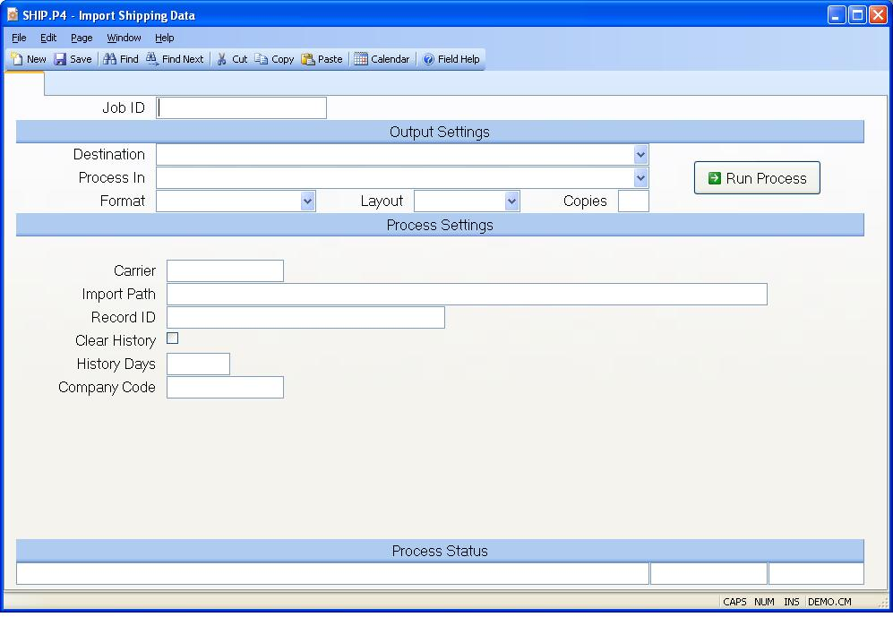

##  Import Shipping Data (SHIP.P4)

<PageHeader />

##

**Job ID** Enter a unique ID if you wish to enter and save the parameters to
this procedure for future use. If you only need to run the procedure and do
not want to save your entry then you may leave this field empty.  
  
**Destination** Select the destination for the output from this procedure.  
  
**Process** Select the method to be used for processing the report. Foreground
is always available and must be used when output is directed to anything other
than a system printer (i.e. printers spooled through the database on the host
computer.) Depending on your setup there may be various batch process queues
available in the list that allow you to submit the job for processing in the
background or at a predefined time such as overnight. A system printer must be
specified when using these queues.  
  
**Format** Select the format for the output. The availability of other formats
depends on what is allowed by each procedure. Possible formats include Text,
Excel, Word, PDF, HTML, Comma delimited and Tab delimited.  
  
**Layout** You may indicate the layout of the printed page by specifying the
appropriate setting in this field. Set the value to Portrait if the page is to
be oriented with the shorter dimension (usually 8.5 inches) at the top or
Landscape if the longer dimension (usually 11 inches) is to be at the top.
Portrait will always be available but Landscape is dependent on the output
destination and may not be available in all cases.  
  
**Copies** Enter the number of copies to be printed.  
  
**Run Process** Click on the button to run the process. This performs the save
function which may also be activated by clicking the save button in the tool
bar or pressing the F9 key or Ctrl+S.  
  
**Carrier** Enter the freight carrier you will be importing data for.  
  
**Export Path** This field defines where the output will be sent from this
procedure. The path specified should be the location where the UPS system will
be expecting to retrieve the data.  
  
**Record ID** Enter the record ID which contains the data to be imported.  
  
**Clear history** Check this box if you wish to clear the history from the import file after updating the SHIP records. This data will default in from the [ SHIP.CONTROL ](../../../../../../../../../../../rover/AP-OVERVIEW/AP-ENTRY/AP-E/AP-E-1/MSHIP-E/MSHIP-E-1/SHIP-CONTROL) record but can be changed as required.   
  
**History days** Enter the number of days of history that you want to keep in the import file. This field should be used if all shipments are not processed through [ SHIP.E2 ](../../../../../../../../../../../rover/AP-OVERVIEW/AP-ENTRY/AP-E/AP-E-1/CURRENCY-CONTROL/SO-E/SO-E-4/SHIP-E/SO-P1/SHIP-E2) on the same day the were done on the Fedex / UPS computer. For example, if you process a Fedex shipment on the shipper's computer and want to come back tomorrow and process [ SHIP.E2 ](../../../../../../../../../../../rover/AP-OVERVIEW/AP-ENTRY/AP-E/AP-E-1/CURRENCY-CONTROL/SO-E/SO-E-4/SHIP-E/SO-P1/SHIP-E2) , you will want the import record to be available. Leaving this field empty means that the import record will be cleared each time this procedure is run.   
  
**Company Code** Enter the company code which will be used to extract the default freight account number from the [ MRK.CONTROL ](../../../../../../../../../../../rover/AP-OVERVIEW/AP-ENTRY/AP-E/AP-E-1/CURRENCY-CONTROL/SO-E/MRK-CONTROL) procedure. Please note that a separate [ MRK.CONTROL ](../../../../../../../../../../../rover/AP-OVERVIEW/AP-ENTRY/AP-E/AP-E-1/CURRENCY-CONTROL/SO-E/MRK-CONTROL) record is created for each company code that has been set-up. In [ MRK.CONTROL ](../../../../../../../../../../../rover/AP-OVERVIEW/AP-ENTRY/AP-E/AP-E-1/CURRENCY-CONTROL/SO-E/MRK-CONTROL) there is a field for the freight account. If that field is blank, this program needs to know what freight account shuold be posted to shipments that will be billing the customer for freight. Therefore, the company code used in this procedure should be a company code for which the freight account has been defined in [ MRK.CONTROL ](../../../../../../../../../../../rover/AP-OVERVIEW/AP-ENTRY/AP-E/AP-E-1/CURRENCY-CONTROL/SO-E/MRK-CONTROL) .   
  
**Last Status Message** Contains the last status message generated by the
program.  
  
**Last Status Date** The date on which the last status message was generated.  
  
**Last Status Time** The time at which the last status message was generated.  
  
  
<badge text= "Version 8.10.57" vertical="middle" />

<PageFooter />