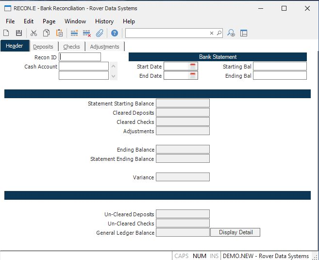

##  Bank Reconciliation (RECON.E)

<PageHeader />

##  Header

**Recon ID** If you are peforming a new bank statement reconciliation, leave
this field empty. Use this field to review a previous reconconciliation.  
  
**Cash Acct** Enter the General Ledger account number(s) for the bank account
you are reconciling.  
  
**Month Start** Enter the starting date for the month you are reconciling.  
  
**Month End** Enter the ending date for the month you are reconciling. This
date will also be used as the clear date for cleared transactions.  
  
**Bal Start** Enter the statement starting balance.  
  
**Bal End** Enter the ending statement balance for the period being
reconciled.  
  
**Stmt Starting Bal** This field contains the statement starting balance shown
above.  
  
**Cleared Deposits** This field contains the total amount of cleared deposits.  
  
**Uncleared Deposits** This field contains the total of the uncleared
deposits.  
  
**Cleared Checks** This field contains the total amount of checks cleared.  
  
**Un-cleared Checks** This field contains the total amount of the uncleared
checks.  
  
**Adjustments** This field contains the total adjustments.  
  
**Ending Balance** This field is the calculated ending balance from the
figures above.  
  
**Stmt Ending Bal** This field contains the statement ending balance entered
above.  
  
**Variance** This field contains the difference between the statement ending
balance and the calculated ending balance.  
  
**G/L Balance** This field contains the general ledger balance. The balance
posted to the general ledger will differ from the bank balance because the g/l
balance will include the un-cleared checks and deposits but the bank or
statment balance will not include those un-cleared amounts. This field is
calculated by subtracting the un-cleared checks and adding the un-cleared
deposits to the ending bank statement.  
  
If this field does not reconcile to the general legder (i.e. the trial balance
reports), you should do the following:  
1\. Verify that all register records have been interfaced to the g/l .  
2\. Verify that all journal entries have been posted to the g/l. You can run [ GLTRANS.R2 ](GLTRANS-R2/README.md) to view any un-posted transactions.   
3\. Verify that no additional CASH or CHECK transactions have been made into
the associated period but not referenced on this record. You can do this by
selecting the LOAD NEW DEPOSITS and LOAD NEW CHECK options on the following
tabs.  
4\. Verify that a journal entry has been made for the amounts referenced on
the ADJUSTMENTS tab.  
  
**Display Detail** Press this button to show display the detail for the
general ledger balance.  
  
  
<badge text= "Version 8.10.57" vertical="middle" />

<PageFooter />