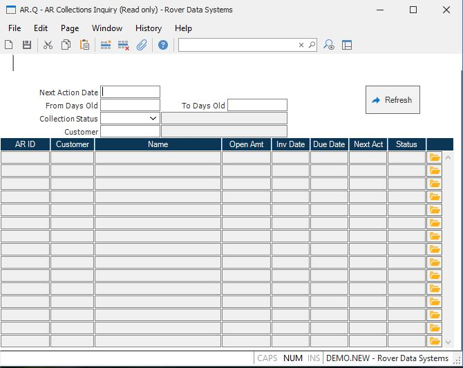

##  AR Collections Inquiry (AR.Q)

<PageHeader />

##

** **  
  
**Next action date** Enter the next action date that you wish to use to select
records to display.  
  
**From Days old** Enter the "from" number of days old an AR record will have
to be to be selected.  
  
**To Days Old** Enter the ending number of days for the range of "days old"
you wish to include.  
  
**Collection Status** Select the collection status for which AR items will be
included.  
  
**Customer** Enter the customer number for which you wish to list AR records.  
  
**Status desc** This field contains the collection status description.  
  
**Customer name** This field contains the customer name.  
  
**AR ID** This field contains the AR item number and is for display only.  
  
**Customer** The customer number assigned to the AR item.  
  
**Name** The customer name.  
  
**Open Amt** This field contains the open amount for the associated AR record.  
  
**Inv Date** This field contains the invoice or record date for the AR item.  
  
**Due date** This field contains the due date.  
  
**Next action date** This field contains the next action date, as read from
the AR record.  
  
**Status** This field contains the collection status code, as read in the AR
record.  
  
**** Press this button to open the associated AR item in [ AR.E ](../../../AR-ENTRY/AR-E/README.md) .   
  
**Refresh** Press this button to refresh the data on the screen.  
  
  
<badge text= "Version 8.10.57" vertical="middle" />

<PageFooter />