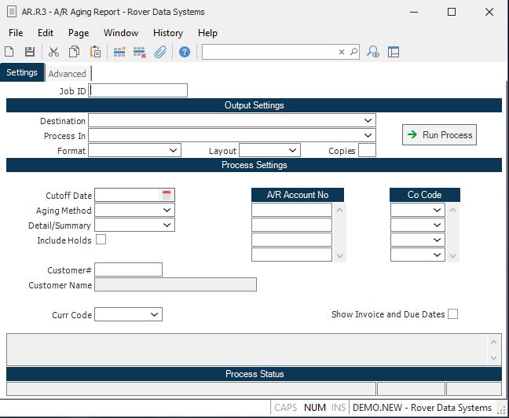

##  A/R Aging Report (AR.R3)

<PageHeader />

##

**Job ID** Enter a unique ID if you wish to enter and save the parameters to
this procedure for future use. If you only need to run the procedure and do
not want to save your entry then you may leave this field empty.  
  
**Destination** Select the destination for the output from this procedure.  
  
**Process** Select the method to be used for processing the report. Foreground
is always available and must be used when output is directed to anything other
than a system printer (i.e. printers spooled through the database on the host
computer.) Depending on your setup there may be various batch process queues
available in the list that allow you to submit the job for processing in the
background or at a predefined time such as overnight. A system printer must be
specified when using these queues.  
  
**Format** Select the format for the output. The availability of other formats
depends on what is allowed by each procedure. Possible formats include Text,
Excel, Word, PDF, HTML, Comma delimited and Tab delimited.  
  
**Layout** You may indicate the layout of the printed page by specifying the
appropriate setting in this field. Set the value to Portrait if the page is to
be oriented with the shorter dimension (usually 8.5 inches) at the top or
Landscape if the longer dimension (usually 11 inches) is to be at the top.
Portrait will always be available but Landscape is dependent on the output
destination and may not be available in all cases.  
  
**Copies** Enter the number of copies to be printed.  
  
**Run Process** Click on the button to run the process. This performs the save
function which may also be activated by clicking the save button in the tool
bar or pressing the F9 key or Ctrl+S.  
  
**Cutoff Date** Enter the date to be used as the cutoff date for the aging
report. Any invoices dated after this date will not be included. Any checks
dated after this dated will also be excluded from the report.  
  
**Aging Method** This prompt determines which method is used to run the aging
report. There are three options:  
  
Invoice Date  
The invoices that are included in the report are determined by the invoice
date and the aging period is also determined by the invoice date.  
  
Due Date  
The invoices that are included in the report are determined by the invoice
date, but the aging period is determined by the due date. If the terms code
allows for split due dates then the aging date that appears on this report
will not be the due date posted to the AR record but will be calculated based
on the due days and percentages entered in the terms record.  
  
Register Date  
The invoices that are included in the report are determined by the register
date, but the aging period is determined by the invoice date. This is the
aging method that should be selected when reconciling the aging report to the
general ledger.  
  
**Detail/Summary** If you wish to print a detail aging report, select
"Detail". If you wish to print a summary aging (one line per customer), select
"Summary".  
  
**Include Holds** Check this box if you want to include items on hold in the
aging.  
  
**Customer#** Enter a customer number if you wish to run the aging report for
that customer only. Otherwise,  
leave this field null to print all customers. If you do not know the customer
number, there is an  
option in the help menu for this prompt which allows you to select the
customer by name.  
  
**Customer Name** The customer name associated with the customer number
entered.  
  
**Currency Code** If you wish to print the aging in a foreign currency, enter
the currency code in this field. Only invoices with this currency code will be
included on the report.  
  
**A/R Account Number** Enter the a/r account number(s) you wish to run this
report for. If left blank, all accounts will be included.  
  
**Co Code** Enter the company codes you wish to appear on this report. If left
blank all company codes will be included.  
  
**Last Status Message** Contains the last status message generated by the
program.  
  
**Last Status Date** The date on which the last status message was generated.  
  
**Last Status Time** The time at which the last status message was generated.  
  
**Message Box** This field contains messages that should be reviewed before
running the report.  
  
  
<badge text= "Version 8.10.57" vertical="middle" />

<PageFooter />