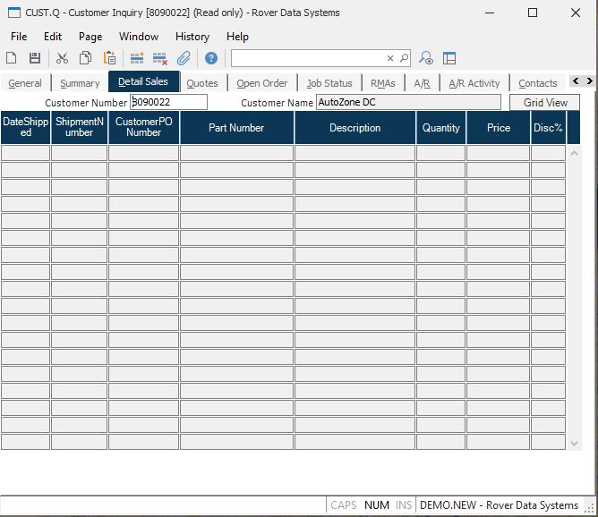

##  Customer Inquiry (CUST.Q)

<PageHeader />

##  Detail Sales

**Customer Name** The customer number for which the data is being displayed.  
  
**Cust Name** The name of the customer as it appears in the Cust file.  
  
**Date** The sales/ship date as it appears in the Sales file.  
  
**Ship.ID** The shipment number as it appears on the Sales file.  
  
**Purchase Order** This field contains the purchase order number for the
associated shipment.  
  
**Part.Number** The part number that was shipped to the customer.  
  
**Description** The parts description.  
  
**Qty** The quantity shipped to the customer.  
  
**Unit Price** The unit price for the part number shipped.  
  
**Disc%** The percent discount allowed.  
  
**Grid View** Select this button to display the contents of this screen in a
grid viewer.  
  
  
<badge text= "Version 8.10.57" vertical="middle" />

<PageFooter />