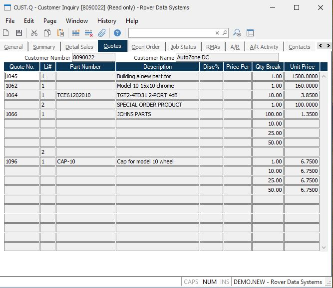

##  Customer Inquiry (CUST.Q)

<PageHeader />

##  Quotes

**Customer Number** Displays the customer id.  
  
**Customer Name** Displays the customer name.  
  
**Quote Number** Displays the number of each open quote for the customer.  
  
**LI#** Displays each line item number on the quote.  
  
**Part Number** Displays the part number for each line item.  
  
**Description** Displays the description of each line item on the quote.  
  
**Discount Percent** Displays the discount to be applied to the line item.  
  
**Price Per** Indicates the scaling factor for the unit price. For example, if
the price were $1.00 per 1000 units this field would contain 1000 and the unit
proce field would contain 1.00.  
  
**Quantity Break** Displays each quantity price break point.  
  
**Unit Price** Displays the unit price at the associated quantity break.  
  
  
<badge text= "Version 8.10.57" vertical="middle" />

<PageFooter />