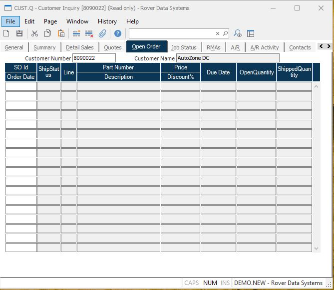

##  Customer Inquiry (CUST.Q)

<PageHeader />

##  Open Order

**Customer Number** The customer number.  
  
**Customer Name** The customer name.  
  
**Sales Order** The identification of the sales order and order date
associated with the items.  
  
**Open Ship#** The status of the most recent shipment for this line item.  
  
**Li#** The line item of the associated item on the order.  
  
**Part Number** The part number ordered.  
  
**Price** The unit price charged for the associated item.  
  
**Sched Date** The dates on which the remaining balance is scheduled.  
  
**Quantity** The open balance of the item due on the associated schedule date.
This includes quantity on shipments that are "new" or "shipped".  
  
**Order Date** The quantity previously shipped on posted shipments.  
  
  
<badge text= "Version 8.10.57" vertical="middle" />

<PageFooter />