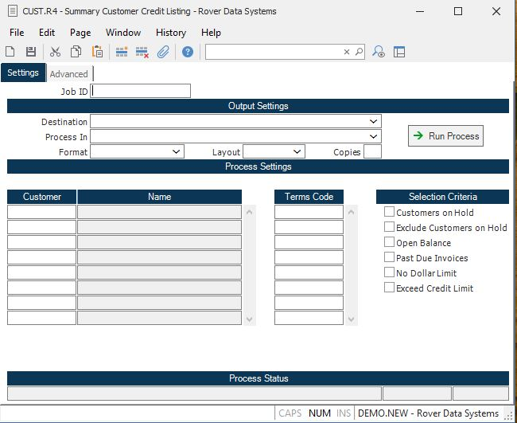

##  Summary Customer Credit Listing (CUST.R4)

<PageHeader />

##

**Job ID** Enter a unique ID if you wish to enter and save the parameters to
this procedure for future use. If you only need to run the procedure and do
not want to save your entry then you may leave this field empty.  
  
**Destination** Select the destination for the output from this procedure.  
  
**Process** Select the method to be used for processing the report. Foreground
is always available and must be used when output is directed to anything other
than a system printer (i.e. printers spooled through the database on the host
computer.) Depending on your setup there may be various batch process queues
available in the list that allow you to submit the job for processing in the
background or at a predefined time such as overnight. A system printer must be
specified when using these queues.  
  
**Format** Select the format for the output. The availability of other formats
depends on what is allowed by each procedure. Possible formats include Text,
Excel, Word, PDF, HTML, Comma delimited and Tab delimited.  
  
**Layout** You may indicate the layout of the printed page by specifying the
appropriate setting in this field. Set the value to Portrait if the page is to
be oriented with the shorter dimension (usually 8.5 inches) at the top or
Landscape if the longer dimension (usually 11 inches) is to be at the top.
Portrait will always be available but Landscape is dependent on the output
destination and may not be available in all cases.  
  
**Copies** Enter the number of copies to be printed.  
  
**Run Process** Click on the button to run the process. This performs the save
function which may also be activated by clicking the save button in the tool
bar or pressing the F9 key or Ctrl+S.  
  
**Last Status Message** Contains the last status message generated by the
program.  
  
**Last Status Date** The date on which the last status message was generated.  
  
**Last Status Time** The time at which the last status message was generated.  
  
**Customer** If you wish to limit this report to certain customers, enter
those customer numbers in this field. If an entry is made in this field, the
selection critieria will be ignored.  
  
**Customer Name** The name of the customer.  
  
**Terms Code** If you wish to run this report for customers with specific
terms, enter the terms codes in this field. Leave this field blank to include
all customers.  
  
**Customers On Hold** If you only wish to include customers on hold, check
this box.  
  
**Exclude Customers on Hold** If you wish to exclude customers on credit hold,
check this box.  
  
**Open Balance** Check this box if you only wish to include customers with an
open A/R or sales order amount.  
  
**Past Due Invoices** Check this box if you only wish to include customers with past due invoices. For purposes of this report, the invoice is considered past due if it exceeds the day limit referenced in [ CUST.E ](../../../AR-ENTRY/CUST-E/README.md) or [ AR.CONTROL ](../../../AR-ENTRY/AR-CONTROL/README.md) .   
  
**No Dollar Limit** Check this box if you only wish to include customers for which no dollar or credit limit has been defined in [ CUST.E ](../../../AR-ENTRY/CUST-E/README.md) .   
  
**Exceed Credit Limit** Check this box if you wish to include customers that
have exceeded their credit limit.  
  
  
<badge text= "Version 8.10.57" vertical="middle" />

<PageFooter />