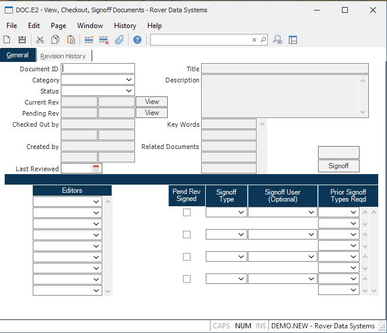

##  View, Checkout, Signoff Documents (DOC.E2)

<PageHeader />

##  General

**ID** Enter a document ID to edit an existing document. New documents may not
be created with this procedure. All data in this screen is view only. It is
mostly for viewing document information, checking out and signing off
documents.  
  
**Category** The document category.  
  
**Title** The document title will be displayed in [ DOC.Q ](../../../DOC-REPORT/DOC-Q/README.md) and in the lookups.
  
**Desc** The document description.  
  
**Status** The possible statuses are:  
Draft - for new documents.  
Change in Process - for released documents that are going through a revision
change.  
Signoff - For changes or drafts in the signoff process.  
Released - When a document or revision change has been fully signed off.  
Retired - For documents no longer in use.  
  
New documents are automatically set to "Draft" status. Other statuses can only be changed by a document controller (administrator security level in [ DOC.CONTROL ](../../DOC-CONTROL/README.md) ) in [ DOC.E ](../../DOC-E/README.md) .
  
**T Curr Rev** This is the current revision of the document if it has been
released.  
  
**T Curr Rev Eff Date** The current revision date of the document, if it has
been released.  
  
**View**  
  
**T Pending Revision** This is the pending revision of the document if it is
in draft, change in process, or signoff status.  
  
**Pend Rev Date** This is the pending revision date of the document if it is
in draft, change in process, or signoff status. It is set by the system when a
revision is started.  
  
**View**  
  
**Key Words** Key words that are not contained in the description and title
will be used for searching for this document. Words from the title and
description will automatically be included in the key word index for
searching.  
  
**Checkout User** This is the userid of the person who currently has checked
out the document. This person must be an editor for the document.  
  
**Checkout Date** This is the date the document was checked out.  
  
**Checkout Time** This is the time the document was checked out.  
  
**Created By** This displays the userid who created this document.  
  
**Date Created** This is the date the document was created.  
  
**Time Created** This displays the time the document was created.  
  
**Last Reviewed** Enter the date the document was last reviewed.  
  
**Related Docs** The list of related documents for reference.  
  
**Editors** Editors are not allowed to sign off the document unless they are
also added to the signoff list to the right. A user must be an editor to check
out a document.  
  
**Req Sign Type** The signoff type as defined in [ DOC.CONTROL ](../../DOC-CONTROL/README.md) .
  
**Req Sign User** The signoff user is optional. If entered, this userid will be allowed to sign off a pending revision. If not entered, then any user within the signoff type will be allowed to sign off a pending revision. The association of which users belong to which types is defined in [ DOC.CONTROL ](../../DOC-CONTROL/README.md) .
  
**Req Type Dependent** This is to control if there is a specific order in
which the signoffs need to happen. The first in the list will have no entry
here. The second in the list could be dependent on the first signoff type, so
you would enter the first signoff type here. They need to be entered in the
order of dependency.  
  
**Sigoff Type Done** This box will be checked if the associated signoff type
or user or signoff type has signed off the pending revision for the document.  
  
**Check Out** Press this button to check in or check out the document. You
must be designated as an editor of the document in order to do this function.  
  
**Signoff** Press this button to signoff on a document. The document must be
in signoff status and you must have been added as an editor for this document
by the administrator.  
  
  
<badge text= "Version 8.10.57" vertical="middle" />

<PageFooter />