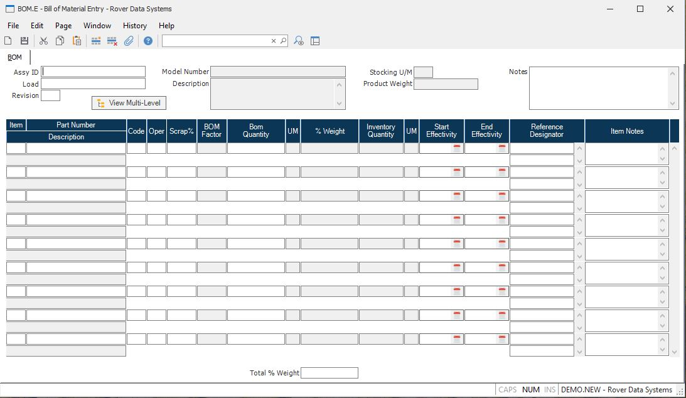

##  Bill of Material Entry (BOM.E)

<PageHeader />

##  BOM

**Assy** Enter the part number which identifies this bill of material record.
The part number must already exist on the PARTS file.  
  
**Rev** Enter the revision level associated with this bill of material. The
revision is initially loaded from the PARTS file, but may be changed in this
procedure. If changed the new revision will be written to the associated PARTS
file record.  
  
**Load** Enter the ID of the bill of material you want to use as the starting
point for creating this bill of material. The contents of the item you enter
will be loaded into this record.  
  
**Item** Enter the line item number for this position. The line item number
should correspond to the item number on the engineering parts list and may be
any integer number between 0 and 999.  
  
**Part** Enter the part number of the component or assembly for this line
item. You may also leave this field blank if the associated line item is a
reference line. If you do enter a part number it must already be present on
the PARTS file.  
  
**Description** Contains the first line of the description of the associated
part number. It is shown on the screen for reference only and may not be
changed.  
  
**Code** Enter one of the following codes which defines the designation for this part number in reference to this bill of material. The code is initially defaulted from the PARTS file record for the associated part number, but may be changed as required. Subsequent changes to the code in the PARTS file do not affect the bill of material record, however the [ BOM.P1 ](BOM-P1/README.md) procedure is available to reset all type codes equal to the code in the PARTS file. The available codes are...   
C - Component part from stock.  
A - Completed assembly from stock.  
P - Assembly whose components will be pulled  
from stock.  
L - Line stock.  
* - Comment line.   
  
**Backflush Oper** If material backflush is used in the production process you
have the option of specifying when individual items on the bill of material
are to be consumed. Enter the letter "F" if the part number is to be consumed
when the assembly is moved from the first step in the routing. Enter "L" if it
should be consumed when items are moved from the last step in the routing
(typically when the assembly is finished). Enter "P" if you want to pull this
part via the picker before the first operation. Or enter the specific
operation number in the routing from which the part number should be consumed
when assemblies are moved through it. If you leave this field blank or it is
set to something other than the codes described or a valid operation in the
routing the letter "L" will be assumed. These settings do not have any affect
unless the work order is designated as a backflush order.  
  
**Bom UM Factor** This is the BOM U/M factor from the parts master. It is
shown for reference only and may not be changed. It is used in conjunction
with the Bill of Material quantity to convert to the stocking unit of measure
quantity. The factor is divided into the BOM quantity to calculate the stock
quantity. If no factor is defined, then the stock quantity is the same as the
BOM quantity.  
  
**Bom Qty** Enter the quantity required of this item for each assembly. The
entry may contain up to 4 decimal places, and must be greater than or equal to
zero. If a negative number is entered the work order picking and backflush
operations will treat the associated part as a return to stock item, moving
the item from the WIP location back to stock rather than the normal stock to
WIP movement. Negative entries will also affect the standard cost rollup by
reducing their value from the total for the parent assembly.  
  
**BOM U/M** Contains the bill of material unit of measure for the associated
part number. It is shown here for reference only and may not be changed.  
  
**Quantity** This is the quantity in inventory unit of measure. It is for
information only and is calculated using the BOM quantity entered divided by
the BOM U/M factor as displayed from the PARTS file.  
  
**Inv U/M** Contains the stocking unit of measure for the associated part
number. It is shown here for reference only and may not be changed.  
  
**Start Date** If the associated part number is to become effective on a
specified date then enter that date in this field, otherwise leave this field
blank. For example, if you were changing to a new part number on 6-30-2006 you
would enter 6-29-2006 in the end effectivity date field for the old part
number line and enter 6-30-2006 in the start effectivity field on the new part
number line. Procedures such as MRP and work order picklist creation will
check this date to determine if the part should be included in processing.  
  
**End Date** If the associated part number is not to be used after a specified
date then enter that date in this field, otherwise leave this field blank. For
example, if you were changing to a new part number on 6-30-2006 you would
enter 6-29-2006 in the end effectivity date field for the old part number line
and enter 6-30-2006 in the start effectivity field on the new part number
line. Procedures such as MRP and work order picklist creation will check this
date to determine if the part should be included in processing.  
  
**Ref.Des** Enter any reference designation information applicable to this
part.  
  
**Desc** Contains the first line of the description from the associated parts
master record. It may not be changed in this procedure.  
  
**View Multi-Level** Click this button to display the current bill of material
in a data grid that allows you to drill down through the lower levels.  
  
  
<badge text= "Version 8.10.57" vertical="middle" />

<PageFooter />