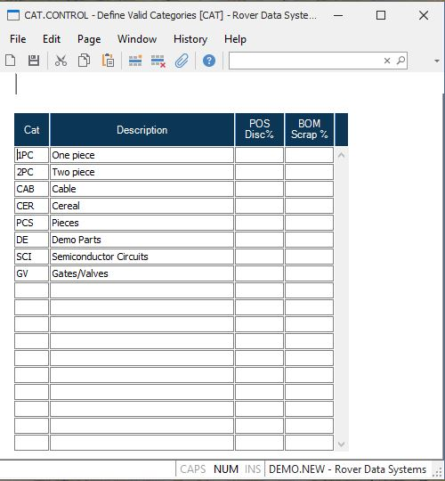

##  Define Valid Categories (CAT.CONTROL)

<PageHeader />

##

**Control ID** The ID "CAT" is automatically entered and is the only vaild ID
for this procedure.  
  
**Category** Enter the category that you wish to define.  
  
**Description** Enter the description of the corresponding category code.  
  
**POS Discount%** Enter the discount that is to be allowed on all part numbers with the associated category code. This percentage will be defaulted automatically when the item is entered on an order. Note: This only applies to point of sales ( [ PSO.E ](../../../../MRK-OVERVIEW/MRK-ENTRY/PSO-E/README.md) ).   
  
  
<badge text= "Version 8.10.57" vertical="middle" />

<PageFooter />