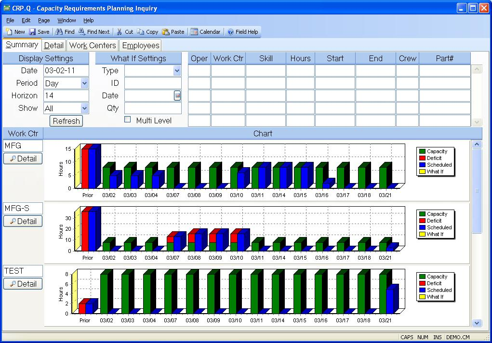

##  Capacity Requirements Planning Inquiry (CRP.Q)

<PageHeader />

##  Summary

**ID** The ID field is hidden and not used by the procedure.  
  
**Display Date** Enter the start date for the first period to be displayed. If
Period is set to Weeks the first Monday of the week in which the date appears
will be the start date. If Period is set to Months then the first day of the
month in which the date appears will be used.  
  
**Display Period** Select the period to be used in grouping the capacity
information. Options are Day, Week and Month.  
  
**Display Horizon** Enter the number of periods to be included in the display.  
  
**Display Show** Select All to display every work center. Select Deficit to
display only those work centers where there is insufficient capacity
available.  
  
**What If Type** This inquiry allows you to view the impact on capacity for a
new requirement. You must indicate the source of the information to be used.
Entering "Part" will determine the rouing information through the part number.
Entering "Quote" will use the routing information defined in a record from the
Quote file.  
  
**What If ID** Enter the part number or quote number to be used as the source
for the capacity requirements to be added.  
  
**What If Date** Enter the date on which the proposed item is to be completed.
Requirements will be back scheduled from this date.  
  
**What If Qty** Enter the quantity of the proposed item to be added to the
schedule.  
  
**Multi-Level What If** Check this box if you want the What If figures to
include subassemblies. This would only apply if using the "Part" type in the
what if settings.  
  
**Routing Oper** Displays the routing operation numbers for each step of the
routing associated with the What If parameters.  
  
**Routing Work Center** Displays the work center associated with the routing
step.  
  
**Routing Skill** Displays the skill code associated with the operation.  
  
**Routing Hours** Displays the hours, including setup, for the operation.  
  
**Routing Start Date** Displays the date on which the operation will be
started.  
  
**Routing End Date** Displays the end date for the operation.  
  
**Routing Crew** Displays the number of employees that will be assigned to the
operation. You may change this number to see its affect on the capacity plan.  
  
**Routing Part** Displays the assembly part for each step of the routing
associated with the What If parameters. There will only be one part number
listed unless the "Multi Level" option is chosen.  
  
**Refresh** Click this button to perform the "What If" calculation using the
Type, ID, Date and Quantity entered. In the absence of all or part of these
parameters the data from the current schedule will be recalculated and
displayed.  
  
**Summary Work Center** Displays each work center name.  
  
**Summary Chart** Displays a bar chart showing the capacity utilization for
each priod.  
  
**Detail** Click this button to display the associated work center on the
detail page.  
  
  
<badge text= "Version 8.10.57" vertical="middle" />

<PageFooter />