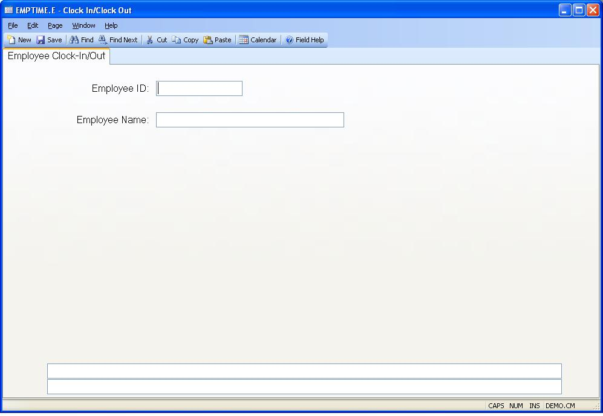

##  Clock In/Clock Out (EMPTIME.E)

<PageHeader />

##  Employee Clock-In/Out

**Employee ID** Enter the number which identifies the employee to be clocked-
in or clocked-out.  
  
**Employee Name** Contains the name of the employee entered.  
  
**Message1** Contains an informational message about the last successful
transaction.  
  
**Message2** Contains an informational message about the last successful
transaction.  
  
  
<badge text= "Version 8.10.57" vertical="middle" />

<PageFooter />