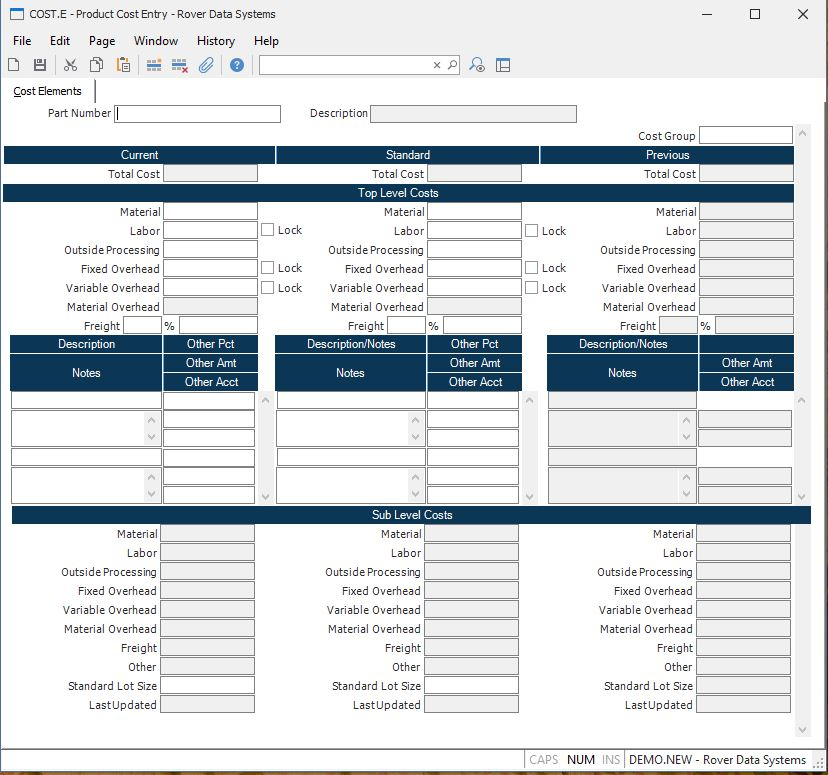

##  Product Cost Entry (COST.E)

<PageHeader />

##  Cost Elements

**Part Number** Enter the part number associated to the costs to be entered or
changed.  
  
**Description** Displays the description of the associated part number as it
appears in the PARTS master file. Only the first line is displayed.  
  
**Cost Group** Enter the cost group which will be validated against [ INV.CONTROL ](../../../../../../../../../../../rover/AP-OVERVIEW/AP-ENTRY/AP-E/AP-E-2/INV-CONTROL) . The cost group is used to define the costing method and to group inventory locations together for averaging the cost within those locations.   
  
**Total Current Cost** The amount in this field represents the total cost of
the associated part number, and is the total of all of the other costs.  
  
**Current Material** Enter the material cost for the associated part number if
the part is a component or line stock item. If the part number identifies an
assembly then this amount will be calculated and loaded by the cost rollup
procedure.  
  
**Current Labor** If the associated part number identifies an assembly then
the labor amount will be calculated and loaded by the cost rollup procedure.
You may enter this cost directly if have not specified a routing for the part
in the parts master record. If you enter a cost, only enter the amount
incurred for this part number. Do not include lower level labor costs.  
  
**Curr Outside Processing** Enter the outside processing costs for this part
if it identifies an assembly. Enter only the amount incurred at the level of
this part, do not include sub-level costs.  
  
**Curr Fixed Overhead** Contains the top level labor fixed overhead for part
as calculated by the cost rollup procedure.  
  
**Curr Variable Overhead** Contains the top level labor variable overhead for
the part as calculated by the cost rollup procedure.  
  
**Curr Material Overhead** Contains the amount of top level material overhead
calculated for this part by the cost rollup procedure.  
  
**Cur Frt Pct** Enter the freight percentage for the associated part number if
the part is a component or line stock item. If the part number identifies an
assembly then the freight amount will be calculated and loaded by the cost
rollup procedure. The freight amount in the next prompt will be calculated
using the freight% entered times the material cost. Optionally, this prompt
can be left null and the freight amount can be entered directly.  
  
**Cur Frt Amt** Enter the freight cost for the associated part number if the
part is a component or line stock item. If the part number identifies an
assembly then this amount will be calculated and loaded by the cost rollup
procedure. If a freight percentage has already been entered then this amount
will be calculated using the % entered times the material cost and may not be
changed, unless the % is removed.  
  
**Cur Other Desc** Enter the description for any other cost for the associated
part number.  
  
**Cur Other Amt** Enter an amount and account for the associated part number
if other predefined costs are to be captured during the receiving process for
buy parts, or the work order finalization process for make parts. This cost
will be rolled up into the total cost.  
  
**Cur Other Acct** Enter an amount and account for the associated part number
if other predefined costs are to be captured during the receiving process for
buy parts, or the work order finalization process for make parts. The account
number will be used when posting variances.  
  
**Cur Other Notes** Enter any notes that pertain to the other costs defined.  
  
**Curr Sub Material** Contains the sum of all sub-level material costs for the
part as calculated by the cost rollup procedure.  
  
**Curr Sub Labor** Contains the total of all sub-level labor costs for the
part as calculated by the cost rollup procedure.  
  
**Curr Sub Outside Process** Contains the total of all sub-level outside
processing costs for the part as calculated by the cost rollup procedure.  
  
**Curr Sub Fixed Overhead** Contains the total of all sub-level fixed overhead
costs fror the part as calculated by the cost rollup procedure.  
  
**Curr Sub Variable Ovhd** Contains the total of all sub-level variable
overhead costs for the part as calculated by the cost rollup procedure.  
  
**Curr Sub Material Ovhd** Contains the total of all sub-level material
overhead costs for the part as calculated by the cost rollup procedure.  
  
**Sub Cur Frt Amt** Contains the sum of all sub-level freight costs for the
part as calculated by the cost rollup procedure.  
  
**Sub Cur Other** Contains the sum of all sub-level "other" costs for the part
as calculated by the cost rollup procedure.  
  
**Curr Std Lot Size** Enter the standard lot size associated with the part
number for calculating costs of purchased parts. This lot size is only used
when calculating the material overhead that should be applied to the part. The
lot size on the routing file is used in the calculation of labor.  
  
**Total Standard Cost** The amount in this field represents the total cost of
the associated part number, and is the total of all of the other costs.  
  
**Standard Material** Enter the material cost for the associated part number
if the part is a component or line stock item. If the part number identifies
an assembly then this amount will be calculated and loaded by the cost rollup
procedure.  
  
**Standard Labor** If the associated part number identifies an assembly then
the labor amount will be calculated and loaded by the cost rollup procedure.
You may enter this cost directly if have not specified a routing for the part
in the parts master record. If you enter a cost, only enter the amount
incurred for this part number. Do not include lower level labor costs.  
  
**Std Outside Processing** Enter the outside processing costs for this part if
it identifies an assembly. Enter only the amount incurred at the level of this
part, do not include sub-level costs.  
  
**Std Fixed Overhead** Contains the top level labor fixed overhead for part as
calculated by the cost rollup procedure.  
  
**Std Variable Overhead** Contains the top level labor variable overhead for
the part as calculated by the cost rollup procedure.  
  
**Std Material Overhead** Contains the amount of top level material overhead
calculated for this part by the cost rollup procedure.  
  
**Std Frt Pct** Enter the freight percentage for the associated part number if
the part is a component or line stock item. If the part number identifies an
assembly then the freight amount will be calculated and loaded by the cost
rollup procedure. The freight amount in the next prompt will be calculated
using the freight% entered times the material cost. Optionally, this prompt
can be left null and.the freight amount can be entered directly.  
  
**Std Frt Amt** Enter the freight cost for the associated part number if the
part is a component or line stock item. If the part number identifies an
assembly then this amount will be calculated and loaded by the cost rollup
procedure. If a freight percentage has already been entered then this amount
will be calculated using the % and may not be changed, unless the % is
removed.  
  
**Std Other Desc** Enter the description for any other cost for the associated
part number.  
  
**Std Other Amt** Enter an amount and account for the associated part number
if other predefined costs are to be captured during the receiving process for
buy parts, or the work order finalization process for make parts. This cost
will be rolled up into the total cost.  
  
**Std Other Acct** Enter an amount and account for the associated part number
if other predefined costs are to be captured during the receiving process for
buy parts, or the work order finalization process for make parts. The account
number will be used when posting variances.  
  
**Std Other Notes** Enter any notes that pertain to the other costs defined.  
  
**Std Sub Material** Contains the sum of all sub-level material costs for the
part as calculated by the cost rollup procedure.  
  
**Std Sub Labor** Contains the total of all sub-level labor costs for the part
as calculated by the cost rollup procedure.  
  
**Std Sub Outside Process** Contains the total of all sub-level outside
processing costs for the part as calculated by the cost rollup procedure.  
  
**Std Sub Fixed Overhead** Contains the total of all sub-level fixed overhead
costs fror the part as calculated by the cost rollup procedure.  
  
**Std Sub Variable Overhead** Contains the total of all sub-level variable
overhead costs for the part as calculated by the cost rollup procedure.  
  
**Std Sub Material Overhead** Contains the total of all sub-level material
overhead costs for the part as calculated by the cost rollup procedure.  
  
**Sub Std Frt Amt** Contains the sum of all sub-level freight costs for the
part as calculated by the cost rollup procedure.  
  
**Sub Std Other** Contains the sum of all sub-level "other" costs for the part
as calculated by the cost rollup procedure.  
  
**Std Lot Size** Enter the standard lot size associated with the part number
for calculating costs of purchased parts. This lot size is only used when
calculating the material overhead that should be applied to the part. The lot
size on the routing file is used in the calculation of labor.  
  
**Total Previous Cost** The amount in this field represents the total cost of
the associated part number, and is the total of all of the other costs.  
  
**Previous Material** Enter the material cost for the associated part number
if the part is a component or line stock item. If the part number identifies
an assembly then this amount will be calculated and loaded by the cost rollup
procedure.  
  
**Previous Labor** If the associated part number identifies an assembly then
the labor amount will be calculated and loaded by the cost rollup procedure.
You may enter this cost directly if have not specified a routing for the part
in the parts master record. If you enter a cost, only enter the amount
incurred for this part number. Do not include lower level labor costs.  
  
**Prev Outside Processing** Enter the outside processing costs for this part
if it identifies an assembly. Enter only the amount incurred at the level of
this part, do not include sub-level costs.  
  
**Prev Fixed Overhead** Contains the top level labor fixed overhead for part
as calculated by the cost rollup procedure.  
  
**Prev Variable Overhead** Contains the top level labor variable overhead for
the part as calculated by the cost rollup procedure.  
  
**Prev Material Overhead** Contains the amount of top level material overhead
calculated for this part by the cost rollup procedure.  
  
**Prv Frt Pct** Enter the freight percentage for the associated part number if
the part is a component or line stock item. If the part number identifies an
assembly then the freight amount will be calculated and loaded by the cost
rollup procedure. The freight amount in the next prompt will be calculated
using the freight% entered times the material cost. Optionally, this prompt
can be left null and.the freight amount can be entered directly.  
  
**Prv Frt Amt** Enter the freight cost for the associated part number if the
part is a component or line stock item. If the part number identifies an
assembly then this amount will be calculated and loaded by the cost rollup
procedure. If a freight percentage has already been entered then this amount
will be calculated using the % and may not be changed, unless the % is
removed.  
  
**Prv Other Desc** Enter the description for any other cost for the associated
part number.  
  
**Prv Other Amt** Enter an amount and account for the associated part number
if other predefined costs are to be captured during the receiving process for
buy parts, or the work order finalization process for make parts. This cost
will be rolled up into the total cost.  
  
**Prv Other Acct** Enter an amount and account for the associated part number
if other predefined costs are to be captured during the receiving process for
buy parts, or the work order finalization process for make parts. The account
number will be used when posting variances.  
  
**Prv Other Notes** Enter any notes that pertain to the other costs defined.  
  
**Prev Sub Material** Contains the sum of all sub-level material costs for the
part as calculated by the cost rollup procedure.  
  
**Prev Sub Labor** Contains the total of all sub-level labor costs for the
part as calculated by the cost rollup procedure.  
  
**Prev Sub Outside Process** Contains the total of all sub-level outside
processing costs for the part as calculated by the cost rollup procedure.  
  
**Prev Sub Fixed Overhead** Contains the total of all sub-level fixed overhead
costs fror the part as calculated by the  
cost rollup procedure.  
  
**Prev Sub Variable Ovhd** Contains the total of all sub-level variable
overhead costs for the part as calculated by the  
cost rollup procedure.  
  
**Prev Sub Material Ovhd** Contains the total of all sub-level material
overhead costs for the part as calculated by the  
cost rollup procedure.  
  
**Sub Prv Frt Amt** Contains the sum of all sub-level freight costs for the
part as calculated by the cost rollup procedure.  
  
**Sub Prv Other** Contains the sum of all sub-level "other" costs for the part
as calculated by the cost rollup procedure.  
  
**Prev Lot Size** This field contains the standard lot size associated with
the part number for calculating costs of purchased parts. This lot size is
only used when calculating the material overhead that should be applied to the
part. The lot size on the routing file is used in the calculation of labor.  
  
**Stamp Date Current** This field is for reference only and cannot be changed. It is updated when [ COST.P1 ](../../../../../../../../../../../rover/AP-OVERVIEW/AP-ENTRY/AP-E/AP-E-2/INV-CONTROL/INV-CONTROL-1/COST-P2/COST-P1) or [ COST.P2 ](../../../../../../../../../../../rover/AP-OVERVIEW/AP-ENTRY/AP-E/AP-E-2/INV-CONTROL/INV-CONTROL-1/COST-P2) is processed.   
  
**Stamp Date Std** This field is for reference only and cannot be changed. It is updated when [ COST.P1 ](../../../../../../../../../../../rover/AP-OVERVIEW/AP-ENTRY/AP-E/AP-E-2/INV-CONTROL/INV-CONTROL-1/COST-P2/COST-P1) or [ COST.P2 ](../../../../../../../../../../../rover/AP-OVERVIEW/AP-ENTRY/AP-E/AP-E-2/INV-CONTROL/INV-CONTROL-1/COST-P2) is processed.   
  
**Stamp Date Previous** This field is for reference only and cannot be changed. It is updated when [ COST.P1 ](../../../../../../../../../../../rover/AP-OVERVIEW/AP-ENTRY/AP-E/AP-E-2/INV-CONTROL/INV-CONTROL-1/COST-P2/COST-P1) or [ COST.P2 ](../../../../../../../../../../../rover/AP-OVERVIEW/AP-ENTRY/AP-E/AP-E-2/INV-CONTROL/INV-CONTROL-1/COST-P2) is processed.   
  
  
<badge text= "Version 8.10.57" vertical="middle" />

<PageFooter />