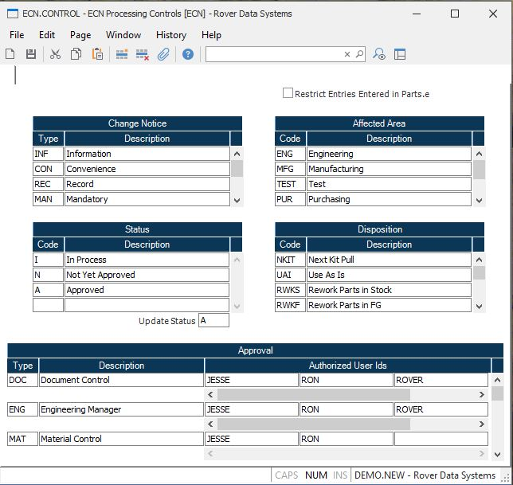

##  ECN Processing Controls (ECN.CONTROL)

<PageHeader />

##

**Control ID** The ID to this record is "ECN" and is loaded automatically by
the system.  
  
**ECN Types** Enter all of the type codes that are valid for an ECN. If left blank, there will be no restrictions on the type code entry in [ ECN.E ](../../../../../../../../../../../../../../../rover/AP-OVERVIEW/AP-ENTRY/AP-E/AP-E-2/INV-CONTROL/INV-CONTROL-1/COST-P2/COST-P1/COST-E/BOM-E/ECN-E) .   
  
**ECN Type Description** Enter the description of the associated ECN type
code.  
  
**Status** Enter all of the status codes that are valid for an ECN. If left blank, there will be no restrictions on the status entry in [ ECN.E ](../../../../../../../../../../../../../../../rover/AP-OVERVIEW/AP-ENTRY/AP-E/AP-E-2/INV-CONTROL/INV-CONTROL-1/COST-P2/COST-P1/COST-E/BOM-E/ECN-E) .   
  
**Status Description** Enter the description of the associated status code.  
  
**Approval Type** Enter all of the approval type codes that are valid for an ECN. If left blank, then there will be no restrictions on the approval type entry in [ ECN.E ](../../../../../../../../../../../../../../../rover/AP-OVERVIEW/AP-ENTRY/AP-E/AP-E-2/INV-CONTROL/INV-CONTROL-1/COST-P2/COST-P1/COST-E/BOM-E/ECN-E) .   
  
**Approval Description** Enter the description of the associated approval
code.  
  
**Authorized User Ids** Enter the login ID's of those people authorized to approved this type. These login ID's will be used in [ ECN.E2 ](ECN-E2/README.md) to verify that the person appoving the ECN is authorized.   
  
**Affected Areas** Enter all of the affected areas that are valid for an ECN. If left blank, then there will be no restrictions on the approval type entry in [ ECN.E ](../../../../../../../../../../../../../../../rover/AP-OVERVIEW/AP-ENTRY/AP-E/AP-E-2/INV-CONTROL/INV-CONTROL-1/COST-P2/COST-P1/COST-E/BOM-E/ECN-E) .   
  
**Affected Area Description** Enter the description of the associated affected
area.  
  
**Disposition Code** Enter all of the disposition codes that are valid for an ECN. If left blank, then there will be no restrictions on the disposition type in [ ECN.E ](../../../../../../../../../../../../../../../rover/AP-OVERVIEW/AP-ENTRY/AP-E/AP-E-2/INV-CONTROL/INV-CONTROL-1/COST-P2/COST-P1/COST-E/BOM-E/ECN-E) .   
  
**Disposition Description** Enter the description of the associated
disposition code.  
  
**Update Status** If you want the system to automatically update the status of an ECN when it is posted to the Parts Master with [ ECN.P1 ](../../../../../../../../../../../../../../../rover/AP-OVERVIEW/AP-ENTRY/AP-E/AP-E-1/MSHIP-E/MSHIP-E-2/Parts-E/ECN-P1) , then enter the status to be used in this field. If left blank then the ECN status will not be changed.   
  
  
<badge text= "Version 8.10.57" vertical="middle" />

<PageFooter />