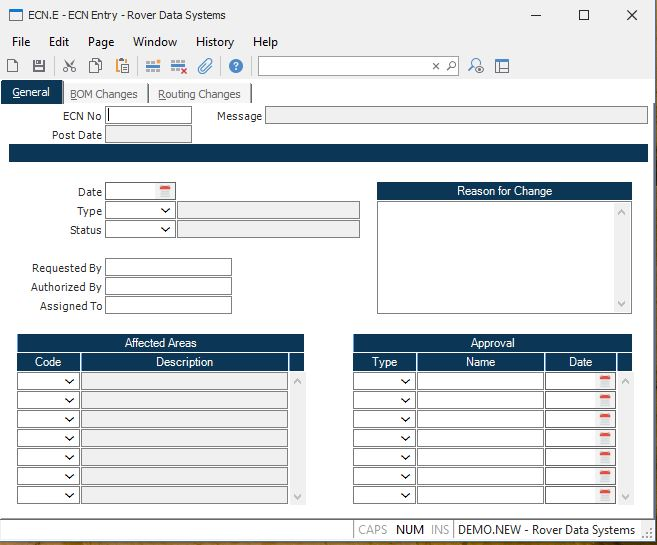

##  ECN Entry (ECN.E)

<PageHeader />

##  General

**ECN No** Enter the number of the ECN you wish to create or change. If you
leave the ECN number blank, the next available sequential number will be
assigned as the ECN number.  
  
**Post Date** If the ECN has been posted, the date it posted will be displayed
in this field. Please note that while you can make changes (including
deletions) to a posted ECN, you cannot re-post the ECN. Therefore, any changes
made in this procedure will need to be made manually to the bill of material
or routing record.  
  
**ECN Date** Enter the date on which the ECN was created. The system will
default the current date for you. It may be changed if appropriate.  
  
**Type** Enter the type code of the ECN being entered. To see a list of the
valid options press the help key.  
  
**Status** Enter the current status of the ECN. To see the available status
codes select the list of valid entry options from the help menu.  
  
**Requested By** Enter the name of the person or entity that requested the
change being made by the ECN.  
  
**Authorized By** Enter the name of the person or entity that authorized the
creation of the ECN.  
  
**Assigned To** Enter the name of the person or entity to which the ECN has
been assigned.  
  
**Change Reason** Enter the reason for the change being made by the ECN.
Multiple lines are available.  
  
**Affected Areas** Enter the names of the areas that are affected by the ECN.  
  
**Affected Area Description** This field contains the description assigned to the associated affected area code. It is defined in the [ ECN.CONTROL ](ECN-CONTROL/README.md) procedure.   
  
**Approval Type** Enter the type or area associated with the approval name and
date. A list of pre-defined approval types will be loaded automatically, and
may be changed as required.  
  
**Approved By** Enter the name of the person giving approval of the ECN for
the associated approval type.  
  
**Approved Date** Enter the date on which the associated approval was granted
for the ECN.  
  
**ECN Type Description** Contains the description of the associated ECN type
code. This field is displayed by the system and may not be changed.  
  
**Status Description** Contains the description of the associated status code.
This field is displayed by the system and may not be changed.  
  
**Post Message** If this ECN has been posted, a message will appear in this
box.  
  
  
<badge text= "Version 8.10.57" vertical="middle" />

<PageFooter />