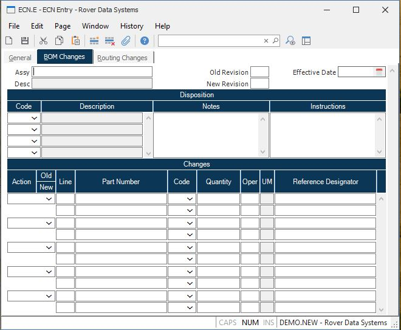

##  ECN Entry (ECN.E)

<PageHeader />

##  BOM Changes

**Assy** Enter the part numbers of the items that are affected by the change
on the ECN.  
  
**Description** Contains the description of the associated part.  
  
**Old Rev** Enter the revision of the associated part number before the change
on the ECN is enacted. The current revision from the parts master will be
loaded into this field, and can be changed if required.  
  
**New Rev** Enter the revision that the associated part number is to carry
after the change on the ECN is implemented. The system will attempt to
determine the next revision level automatically.  
  
**Effective Date** Enter the date on which the change on the ECN is to take
effect for the associated part number.  
  
**Disp Code** Enter the disposition codes to be applied to the associated part
number. Select the list of valid options from the help menu to see the choices
available.  
  
**Disposition Description** Contains the description of the associated
disposition code.  
  
**Disposition Notes** Enter any notes about the disposition of the associated
part number.  
  
**Instructions** Enter any instructions or notes pertaining to the changes
defined for the associated part number.  
  
**Action** Select the way in which the change to the bill of material is to be
performed.  
  
Phase In - Indicates that an existing item is to be changed or a new item is
to be added based on the effectivity date and retains the original information
so that you can run a bill of material report as of a specified date and see
what it looked like at that point in time.  
  
Phase Out - Indicates that an existing item is to be removed based on the
effectivity date and retains the original information so that you can run a
bill of material report as of a specified date and see what it looked like at
that point in time.  
  
Add - Adds a new item that is not based on the effectivity date which
therefore becomes active immediately.  
  
Change - Changes the information on an existing line without retaining
history.  
  
Delete - Removes the information on an existing item without retaining
history.  
  
**Old Li** Enter the number of the line item on the bill of material that is
to be acted upon. If you selected the Add option, then you should skip this
field.  
  
**Old.Part** The part number is loaded automatically based on the line item
number entered.  
  
**Old Part Code** The code is loaded from the bill of material line item
specified. It must be one of the following:  
  
C - Component  
A - Assembly  
P - Phantom Assembly  
L - Line Stock  
* -   
  
**OLD Quantity** The quantity is loaded from the bill of material line item
specified. Negative quantities indicate parts that are recovered during work
order processing and returned to stock.  
  
**Old.Ref.Des** The reference designator is loaded from the bill of material
line item specified.  
  
**Old Oper** Displays the operation as shown under the old definition.  
  
**Bom U/M** Contains the bill of material unit of measure for the associated
part number. It is shown here for reference only and may not be changed.  
  
**New Li** Enter the line item number for the new or changed item.  
  
**New.Part** Enter the the part number that is to appear on the new or changed
item.  
  
**New Part Code** Enter one of the following part codes for the new or changed
item:  
  
C - Component  
A - Assembly  
P - Phantom Assembly  
L - Line Stock  
* -   
  
**New Quantity** Enter the quantity to be used on the new or changed item.
Negative quantities indicate parts that are recovered during work order
processing and returned to stock.  
  
**New.Ref.Des** Enter reference designator to be used on the new or changed
item.  
  
**New Oper** Enter the new operation to be used.  
  
**New Bom U/M** Contains the bill of material unit of measure for the
associated part number. It is shown here for reference only and may not be
changed.  
  
  
<badge text= "Version 8.10.57" vertical="middle" />

<PageFooter />