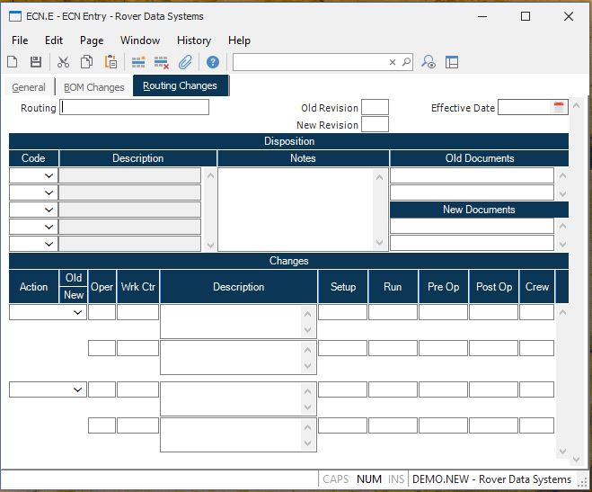

##  ECN Entry (ECN.E)

<PageHeader />

##  Routing Changes

**Routing Id** Enter the id to each of the routings that are to be changed.  
  
**Old Revision** Enter the revision of the associated routing before the
change on the ECN is enacted. The current revision from the routing will be
loaded into this field, and can be changed if required.  
  
**New Revision** Enter the revision that the associated part number is to
carry after the change on the ECN is implemented. The system will attempt to
determine the next revision level automatically.  
  
**Effective Date** Enter the date on which the change on the ECN is to take
effect for the associated routing.  
  
**Disp Code** Enter the disposition codes to be applied to the associated
routing. Select the list of valid options from the help menu to see the
choices available.  
  
**Disposition Description** Contains the description of the associated
disposition code.  
  
**Disposition Notes** Enter any notes about the disposition of the associated
routing.  
  
**Old Documents** Contains the names of all of the documents associated with
the routing before the ECN change.  
  
**New Documents** Contains all of the documents to be associated with the
routing after the change.  
  
**Action** Select the way in which the change to the routing is to be
performed.  
  
Phase In - Indicates that an existing item is to be changed or a new item is
to be added based on the effectivity date and retains the original information
so that you can run a routing report as of a specified date and see what it
looked like at that point in time.  
  
Phase Out - Indicates that an existing item is to be removed based on the
effectivity date and retains the original information so that you can run a
routing report as of a specified date and see what it looked like at that
point in time.  
  
Add - Adds a new item that is not based on the effectivity date which
therefore becomes active immediately.  
  
Change - Changes the information on an existing line without retaining
history.  
  
Delete - Removes the information on an existing item without retaining
history.  
  
**Old Oper** Enter the number of the operation on the routing that is to be
acted upon. If you selected the Add option, then you should skip this field.  
  
**Old WC** The work center is loaded automatically based on the operation
entered.  
  
**Old Description** Displays the description of the operation from the routing
before the operation was changed.  
  
**Old Setup** Contains the setup hours for the operation before the change.  
  
**Old Run** Contains the run hours for the operation before the change.  
  
**Old Pre Op** Contains the pre operation hours before the change.  
  
**Old Post Op** Contains the post operation hours before the change.  
  
**Old Crew** Displays the crew size for the operation before the change.  
  
**New Oper** Enter the operation number for the new or changed operation.  
  
**New Wrk Ctr** Enter the work center to appear on the new or changed item.  
  
**New Description** Enter the description that is to appear on the new or
changed operation.  
  
**New Setup** Enter the setup hours to be used after the change.  
  
**New Run** Enter the run hours to be used after the change.  
  
**New Pre Op** Enter the pre operation hours to be used after the change.  
  
**New Post Op** Enter the post operation hours to be used after the change.  
  
**New Crew** Enter crew size to be used after the change.  
  
  
<badge text= "Version 8.10.57" vertical="middle" />

<PageFooter />