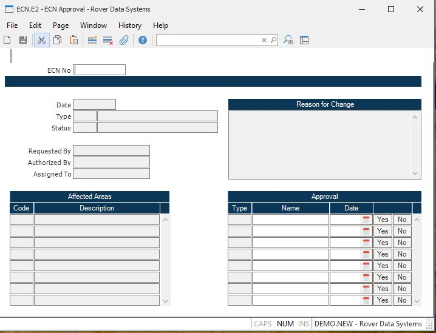

##  ECN Approval (ECN.E2)

<PageHeader />

##

**ECN No** Enter the number of the ECN you wish to create or change. If you
leave the ECN number blank, the next available sequential number will be
assigned as the ECN number.  
  
**ECN Date** The date on which the ECN was created.  
  
**Type** The type codes associated to this ECN.  
  
**Status** The current status of the ECN.  
  
**Requested By** The name of the person or entity that requested the change
being made by the ECN.  
  
**Authorized By** The name of the person or entity that authorized the
creation of the ECN.  
  
**Assigned To** The name of the person or entity to which the ECN has been
assigned.  
  
**Change Reason** The reason for the change being made by the ECN.  
  
**Affected Areas** The names of the areas that are affected by the ECN.  
  
**Affected Area Description** This field contains the description assigned to the associated affected area code. It is defined in the [ ECN.CONTROL ](../../../../../../../../../../../../../../../../../rover/AP-OVERVIEW/AP-ENTRY/AP-E/AP-E-2/INV-CONTROL/INV-CONTROL-1/COST-P2/COST-P1/COST-E/BOM-E/ECN-E/ECN-E-1/ECN-CONTROL) procedure.   
  
**Approval Type** The types or areas associated with the approval name and
date.  
  
**Approved By** Enter the name of the person giving approval of the ECN for the associated approval type. The person approving the ECN must be logged on with a login ID that has been defined in [ ECN.CONTROL ](../../../../../../../../../../../../../../../../../rover/AP-OVERVIEW/AP-ENTRY/AP-E/AP-E-2/INV-CONTROL/INV-CONTROL-1/COST-P2/COST-P1/COST-E/BOM-E/ECN-E/ECN-E-1/ECN-CONTROL) as having authority to approve the particular type.   
  
**Approved Date** Enter the date on which the change on the ECN is to take
effect for the associated routing.  
  
**Yes** Check the Yes button to load the associated approval type with your
user id and current date. Note: you will only be allowed to make adjustments
to approval types you have been authorized to approve.  
  
**No** Check the No button to remove the associated approval user id and date.
Note: you will only be allowed to make adjustments to approval types you have
been authorized to approve.  
  
**ECN Type Description** Contains the description of the associated ECN type
code. This field is displayed by the system and may not be changed.  
  
**Status Description** Contains the description of the associated status code.
This field is displayed by the system and may not be changed.  
  
  
<badge text= "Version 8.10.57" vertical="middle" />

<PageFooter />