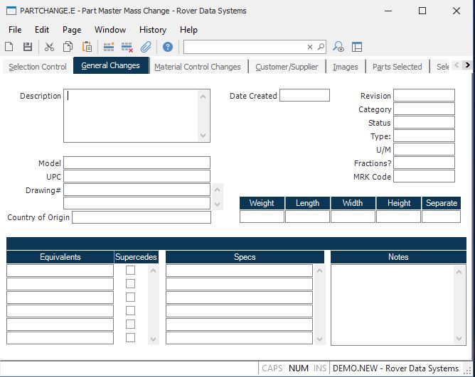

##  Part Master Mass Change (PARTCHANGE.E)

<PageHeader />

##  General Changes

**Wrap Desc** Enter the description you wish to update on the selected
records. An entry must be made in this field.  
  
**Model**  
  
**UPC** This field contains the UPC code assigned for this part number.  
  
**Drawing Number** Enter all of the drawing numbers referenced by the part
number.  
  
**Country Origin** Enter the country of origin for this part number.  
  
**Date Created** Enter the date the parts were created.  
  
**Rev**  
  
**Category**  
  
**Status** Enter one of the following codes which defines the current status
of the part.  
P - Preliminary (awaiting final approvals).  
A - Approved for use.  
C - Change in process.  
I - Inactive (no longer used).  
D - Delete (part flagged for deletion).  
If this code is entered the part will  
become a candidate for deletion by the  
[ PARTS.P2 ](../../../ENG-PROCESS/PARTS-P2/README.md) procedure.   
  
A value must be entered in this field. You cannot use the tilde character to
delete the data in it.  
  
**Type** Enter the code which defines the type of part defined in this record.
Valid codes are...  
C - Component part.  
An item which does not define a bill of  
material.  
A - Assembly.  
An item which has a bill of material and  
is built for stock or shipment.  
P - Phantom assembly.  
An item which defines a bill of material  
but is a sub-assembly to another part and  
built as part of the asembly of that part.  
It is not built to stock.  
L - Line stock  
Items which may be maintained in the stock-  
room, but are moved in bulk to work-in-  
process where they are consumed rather than  
being pulled as part of the kitting list.  
  
A value must be entered in this field. You cannot use the tilde character to
delete the data in it.  
  
**Um** Enter the unit of measure used to account for this part in inventory. The valid codes are entered in the [ UM.CONTROL ](../../UM-CONTROL/README.md) procedure.   
  
**Fractions** Enter a Y in this field if fractional quantities of this part
may be stored in inventory. If a Y is not entered then inventory transactions
against this part must be entered as integer values.  
  
**MRK Code** Enter the marketing code to be used for this part. Marketing
codes are generally used on items that are sold through the marketing module.
If left blank the standard defaults as defined in the marketing module are
used.  
  
**Weight** Enter the unit weight of this part.  
  
**Ship Length**  
  
**Ship Width** Enter the shipping width of the part.  
  
**Ship Height** Enter the shipping height of the part.  
  
**Ship Separate** Enter a "Y" in this field if the part is shipped separately
in it's own box. This information in addition to the weight, length, width and
height is used when calculating the shipping charges for an order.  
  
**Equiv Part** Enter the equivalent part numbers for the main part number being defined in this procedure. You can enter any number of equivalent part numbers. If you wish to clear all data in this field and the supercedes field, enter the tilde (~) character. .Please note that the entries in this field will over-write all existing equivalent part numbers entered in [ PARTS.E ](../../../ENG-ENTRY/PARTS-E/README.md) .   
  
**Supercede Flag** Check this box if the equivalent part number to the left
supercedes the main part number entered on the first tab. This box may only be
checked for one part number in the list. If a tilde (~) character is entered
in the EQUIVALENTS field, all data will be cleared in this field.  
  
**Specs** Enter the specifications that apply to the selected parts. Please
note that the entries made in this procedure will over-write all existing
specifications posted to the parts records. If a tilde (~) is entered in this
field, all existing specifications will be deleted.  
  
**Notes** Enter any notes applicable to the part number. Please note that the entries in this field will over-write the existing notes entered in [ PARTS.E ](../../../ENG-ENTRY/PARTS-E/README.md) .   
  
  
<badge text= "Version 8.10.57" vertical="middle" />

<PageFooter />