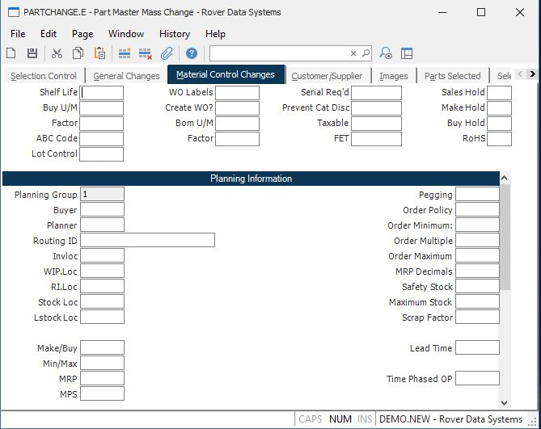

##  Part Master Mass Change (PARTCHANGE.E)

<PageHeader />

##  Material Control Changes

**Shelf Life** Enter the shelf life of the part in days. This information is
used to set the expiration date of lot records for the part.  
  
**Buy U/M** This field contains the purchase unit of measure which will be
used in the purchase order entry procedure.  
  
**Factor** Enter the factor to be used in conjunction with the purchase unit
of measure to convert to stock units of measure in the purchase order
procedures.  
  
**ABC Code** Enter the ABC class code for this part. Options are...  
A - High cost, long lead time or single source.  
(Critical item which could halt production)  
B - Moderate cost, lead time and multiple  
sources.  
C - Low cost and/or short lead time.  
(Not a critical part) The ABC code may be set automatically by the ABC stratification procedure ( [ PARTS.P1 ](../../../../../rover/AP-OVERVIEW/AP-ENTRY/AP-E/AP-E-2/INV-CONTROL/INV-CONTROL-1/CYCLE-P1/CYCLE-P1-1/INV-P1/PARTS-P1) ) if desired.   
  
**Lot Control** Enter a "Y" in this field if the parts are to be lot
controlled. Please note that changes can only be made to this field, if there
is no inventory on hand for any location. When the mass update is performed
for the parts selected in this record, the program will check to see if a
quantity on hand exists. If it does exist, this field will not be changed.  
  
**WO Labels** Enter "Y" if this part is to have labels printed when it appears
on a work order picklist.  
  
**Create WO** If you wish to have the sales order entry process ( [ SO.E ](../../../../../rover/AP-OVERVIEW/AP-ENTRY/AP-E/AP-E-1/CURRENCY-CONTROL/SO-E) ) create work orders automatically for this part, enter "Y". You must also make sure the [ MRK.CONTROL ](../../../../../rover/AP-OVERVIEW/AP-ENTRY/AP-E/AP-E-1/CURRENCY-CONTROL/SO-E/MRK-CONTROL) flag which controls the work order creation option is set to "P".   
  
**Bom Um**  
  
**Bom Um Factor**  
  
**Serial Required**  
  
**No Cat Disc**  
  
**Tax?**  
  
**Fet** Enter the amount of Federal Excise Tax which is to be charged each
time this part is sold.  
  
**Sales Hold**  
  
**Make Hold**  
  
**Buy Hold**  
  
**Rohs**  
  
**Plan Group** This field contains the planning groups that have been defined
in the system. These groups cannot be changed in this procedure. If you have
more than one planning group defined, you must change the information for each
planning group separately.  
  
**Buyer** Enter the code used to define the buyer who is responsible for
placing purchase orders for the part number.  
  
**Planner** Enter the code used to define the planner who is responsible for
planning the part number.  
  
**Routing ID** If the parts record defines an assembly then enter the ID of the routing which is used when the item is produced. If no routing is entered the system will use the default routing in the [ WO.CONTROL ](../../../../../rover/AP-OVERVIEW/AP-ENTRY/AP-E/CHECKS-E/AP-CONTROL/GLCHART-E/GLCHART-E-1/GLCHART-R2/WO-CONTROL) record when a work order is created.   
  
**Invloc** Enter the home location for this part. This location will be used
as a default in the picker.  
  
**WIP.Loc** Enter the work in process location normally used to create this
part. This field will be defaulted into the work order.  
  
**RI.Loc** Enter the inventory location to be used as the receiving location. If this location is different than the inventory location, this field will be defaulted into [ PO.E ](../../../../../rover/AP-OVERVIEW/AP-ENTRY/AP-E/AP-E-1/CURRENCY-CONTROL/PO-E) line items as the inspection location. If this field is left empty, the home inventory location will be used.   
  
**Stock Loc** Enter the default stockroom location for which materials will be
pulled when a work order is created for this part.  
  
**Lstock Loc** The default location from which line stock items will be pulled
when a work order/picker is created for this part.  
  
**Make/Buy** Enter the letter "M" if the part number defines an item which is
made in-house. Enter "B" if it is purchased from an outside source. If the
part is sometimes made in house and sometimes purchased, or it is purchased
but you supply the parts then enter "C" (combination). This code is used by
MRP to determine if demand for lower level components is to be generated.
Requirements for all parts on an assembly unless the Make/Buy code is set to
B. In this case MRP will not create demand for the components even if there is
a bill of material on file.  
  
**Min/Max** Enter "Y" if this part is to be included in the Minimum/Maximum
inventory calculation process.  
  
**MRP** Enter "Y" if this part is to be included in the MRP processing.  
  
**MPS** Enter "Y" if this part is to be included in the MPS processing.  
  
**Pegging** Enter the letter "Y" if requirements pegging is to be maintained
by MRP for the part number. Enter "N" if pegging should not be maintained. As
a general rule, those parts which are common to almost all assemblies and/or
are not of significant value should be set to "N" since knowing the specific
source of demand for the item is not very useful. These types of parts also
tend to slow down the MRP processing.  
  
**Order Policy** Enter the order policy to be used for the part. The options
are...  
D - Discrete.  
Planned orders are generated to match the  
actual quantity required; no more, no less.  
F - Fixed.  
Planned orders are created based on the  
quantity required, and then modified by  
the order modifiers Minimum Order Quantity  
and Order Multiple.  
  
**Order Minimum** Enter the the minimum order quantity to be used when
ordering this part. You may also enter the letter "U" followed by a number
which specifies that the average monthly usage should be used as the order
minimum. The number entered after the "U" indicates the number to multiply the
monthly usage number by to obtain the order minimum. Fractions may be entered
to specify portions of monthly usage (e.g. .5 would be 1/2 month usage). MRP
uses the order minimum to round up the demand for a part so that it is no less
than the order minimum. For example, if the order minimum was set to 100 and
MRP found demand for 77, a planned order would be created for 100. If the
demand was for 110 the planned order would be for 110 since it already
exceeded the minumum.  
  
**Order Multiple** Enter the order multiple to be used when ordering this
part. You may also enter the letter "U" followed by a number which specifies
that the average monthly usage should be used as the order multiple. The
number entered after the "U" indicates the number to multiply the monthly
usage number by to obtain the order multiple. Fractions may be entered to
designate a portion of the monthly usage (e.g. .5 would be 1/2 month). The
order multiple is used by MRP to round up planned order quantities to the next
multiple. For example, if the order multiple was set to 50 and MRP found
demand for 65 the planned order quantity would be rounded up to 100.  
  
**Order Maximum** Enter the the maximum order quantity to be used when
ordering this part. You may also enter the letter "U" followed by a number
which specifies that the average monthly usage should be used as the order
maximum. The number entered after the "U" indicates the number to multiply the
monthly usage number by to obtain the maximum quantity. Fractions may be
entered to designate a portion of the monthly usage (e.g. .5 would be 1/2
month). The maximum quantity serves as a control valve on planned orders by
causing an exception message to be generated when a planned order exceeds the
maximum.  
  
**Mrp Decimals** Enter the number of decimal places that will be used by MRP
for requirements and planned order calculations. This will only need to be set
if the part has bill of material quantities in small fractions that result in
gross requirements of less than 1. Leave blank to default MRP calculations in
whole numbers (normal processing). Valid values are 0 through 4.  
  
**Safety Stock** Enter the amount of inventory that should be considered
safety stock. You may also enter the letter "U" followed by a number to
specify that the safety stock should be based on the average monthly usage.
The number following the "U" may be a fraction and specifies the number of
months of usage (or partial month) to use.  
  
**Maximum Stock** Enter the maximum amount of inventory which should be
maintained for this part number. This number is used in the MRP calculation
and will cause an exception message to be generated if the projected balance
within the MRP horizon exceeds the maximum defined in this field. You may also
enter the letter "U" followed by a number to indicate that the average monthly
usage multiplied by the number should be used as the maximum stock number. You
may also enter a fractional quantity to designate a partial month.  
  
**Scrap Factor** Enter the scrap factor to be used for the part in MRP
processing. The scrap factor should be entered as a percentage (up to 2
decimals allowed) of the parts which you anticipate will be scrapped. For
example, if you determined that 2 and 1/2% of the items will be scrapped then
enter 2.5. The net effect of the scrap factor is to increase the demand for
the item enough to offset the effect of scrap.  
  
**Lead Time** Enter the number of work days lead time normally associated with
this part or enter the letter "D" to indicate that the lead time is to be
calculated dynamically based on the routing and planned order quantity in MRP
and MPS.  
  
**Time Phased OP** Enter the time phased order point quantity for this part if
applicable. The period covered by the quantity entered is 30 days. You may
also choose to enter the letter "U" which will cause the calculation to use
the historical average usage as the quantity. Leave this field blank if no
time phased order point is desired. The net affect of placing a quantity into
this field is that demand in MRP will be calculated as the greater of actual
demand or the quantity entered.  
  
  
<badge text= "Version 8.10.57" vertical="middle" />

<PageFooter />