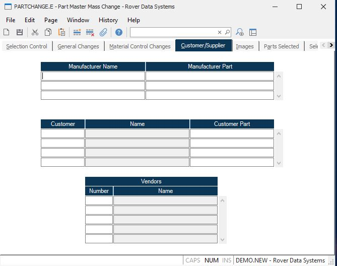

##  Part Master Mass Change (PARTCHANGE.E)

<PageHeader />

##  Customer/Supplier

**Manufacturer Name** Enter the name of the manufacturer who produces this component. Multiple entries are permitted. Please note that the entries in this field will over-write all existing manufacturers entered in [ PARTS.E ](../../PARTS-E/README.md) .   
  
**Mfg Part** Enter the manufacturer's part number in this field.  
  
**Cust** Enter the customer number for the part number cross reference you wish to identify. Please note that the entries in this field will over-write all existing customers entered in [ PARTS.E ](../../PARTS-E/README.md) .   
  
**Customer Name** This field contains the name of the customer as it is found
in the Cust file. This is for reference only.  
  
**Cust Part** Enter the customer part number, for the associated customer
number.  
  
**Vendor Number** Enter the number of each vendor who supplies this part number. This data is also loaded when purchase orders are placed against the part. If you do not know the vendor number, there is an option in the help menu for this prompt which allows you to select the vendor by name. Please note that the entries in this field will over-write all existing vendors entered in [ PARTS.E ](../../PARTS-E/README.md) .   
  
**Vendor Name** Contains the name of the vendor associated with the vendor
number. This information is extracted from the VENDOR file for display
purposes only. It may not be altered on this screen.  
  
  
<badge text= "Version 8.10.57" vertical="middle" />

<PageFooter />