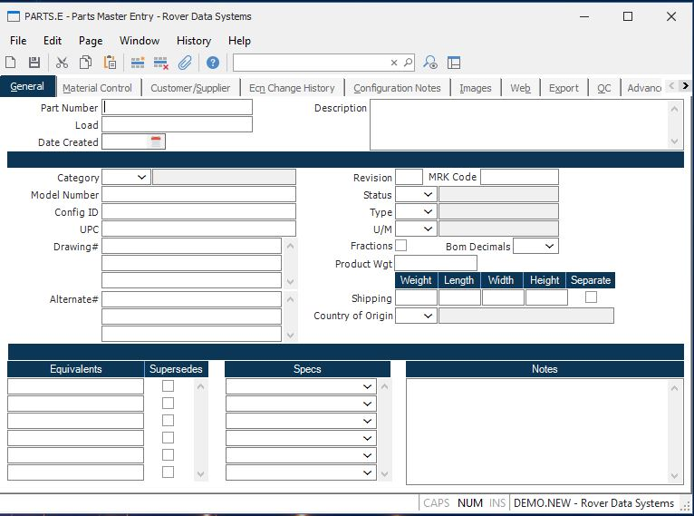

##  Parts Master Entry (PARTS.E)

<PageHeader />

##  General

**Part Number** Enter the number of the part you would like to update or add
to the PARTS file. If you do not know the part number you may access it by
entering either the model number, category, manufacturer part number or
drawing number.  
  
**Load** If you wish to load an existing part number, enter that number here.
All information from that part record will be loaded. This field is only used
with new part records and is not functional  
for existing parts.  
  
**Date Created** Enter the date this part number was created/added to the
parts file. On new records, the current date will be loaded into this field
for you but can be changed as required.  
  
**Description** Enter the description of the part defined by this record. It
is suggested that the first line be used as an abbreviated summary description
(25 characters or less) with the full detailed description entered on
subsequent lines. This is because several reports and query procedures display
only the first line of the description since, in most cases, a summary
description is all that is required for the person using the output. To force
a line feed press Ctrl+Enter.  
  
**Category** If your parts fall into categories which can be defined then you
may use this field to designate the category to which the part belongs. This
code is then used to build a cross reference to all of the parts which
reference it. Report procedures then use this as their major sort criteria.  
For example...  
If your part numbers contained a single  
significant digit in the third position  
(such as the letter "N" in 10N0001-000)  
then you would enter the letter "N" in this  
field.  
  
**Model Number** Enter the internal model number associated with the part
number. This field should be used only for internal model or catalog numbers.
It should not contain the vendors model number for purchased parts. Those
should be entered in the manufacturer part number field.  
  
**Config ID** The information in this field is loaded by the Product
Configurator if it was created as a result of the configuration process. This
field is cross-referenced, and the part number can be obtained by entering
this number instead of the part number. You may manually enter the data in
this field if you do not use the product configurator.  
  
**UPC** This field contains the UPC code assigned for this part number.  
  
**Drawing Number** Enter all of the drawing numbers referenced by the part
number.  
  
**Country of Origin** Enter the country of origin for this part number.  
  
**Revision** Enter the current revision level of the part. This field should
be updated any time the current approved revision level is changed.  
  
**Status** Enter one of the following codes which defines the current status
of the part.  
P - Preliminary (awaiting final approvals).  
A - Active and approved for use.  
C - Change in process.  
I - Inactive (no longer used).  
D - Delete (part flagged for deletion).  
If this code is entered the part will  
become a candidate for deletion by the  
[ PARTS.P2 ](../../../ENG-PROCESS/PARTS-P2/README.md) procedure.   
  
**Type** Enter the code which defines the type of part defined in this record.
Valid codes are...  
C - Component part.  
An item which does not define a bill of  
material.  
A - Assembly.  
An item which has a bill of material and  
is built for stock or shipment.  
P - Phantom assembly.  
An item which defines a bill of material  
but is a sub-assembly to another part and  
built as part of the asembly of that part.  
It is not built to stock.  
L - Line stock  
Items which may be maintained in the stock-  
room, but are moved in bulk to work-in-  
process where they are consumed rather than  
being pulled as part of the kitting list.  
  
**UM** Enter the unit of measure used to account for this part in inventory. The valid codes are entered in the [ UM.CONTROL ](../../UM-CONTROL/README.md) procedure.   
  
**Fractions** Check this box if fractional quantities of this part may be
stored in inventory. If the box is not checked then inventory transactions
against this part must be entered as integer values.  
  
**MRK Code** Enter the marketing code to be used for this part. Marketing
codes are generally used on items that are sold through the marketing module.
If left blank the standard defaults as defined in the marketing module are
used.  
  
**Weight** Enter the unit weight of this part.  
  
**Ship Length** Enter the shipping length of the part.  
  
**Ship Width** Enter the shipping width of the part.  
  
**Ship Height** Enter the shipping height of the part.  
  
**Ship Separate** Check this box if the part is shipped separately in it's own
box. This information in addition to the weight, length, width and height is
used when calculating the shipping charges for an order.  
  
**Equiv Part** Enter the equivalent part numbers for the main part number
being defined in this procedure. You can enter any number of equivalent part
numbers.  
  
**Supercede Flag** Check this box if the equivalent part number to the left
supersedes the main part number entered on the first tab. This box may only be
checked for one part number in the list.  
  
**Specs** This field may contain any user defined specifications which can be used to group this part number with other part numbers with similar specifications. You may limit the entries available to the user by specifying valid codes with the [ SPEC.CONTROL ](../../SPEC-CONTROL/README.md) procedure.   
  
**Notes** Enter any notes applicable to the part number.  
  
**Status Desc** This field contains a description of the status code and is
for reference only.  
  
**Type Desc** This field contains a description of the type code and is for
reference only.  
  
**UM Desc** This field contains a description of the UM code and is for
reference only.  
  
**Category Description** Displays the description of the associated category.  
  
  
<badge text= "Version 8.10.57" vertical="middle" />

<PageFooter />