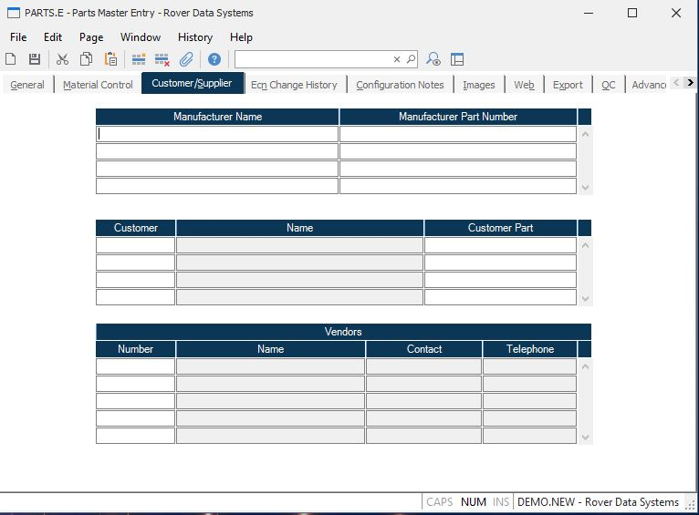

##  Parts Master Entry (PARTS.E)

<PageHeader />

##  Customer/Supplier

**Manufacturer Name** Enter the name of the manufacturer who produces this
component. Multiple entries are permitted.  
  
**Manufacturer Part Number** Enter the number the associated manufacturer uses
to identify the part defined by the PARTS record.  
  
**Cust** Enter the customer number for the part number cross reference you
wish to identify.  
  
**Customer Name** This field contains the name of the customer as it is found
in the Cust file. This is for reference only.  
  
**Cust Part** Enter the customer part number, for the associated customer
number.  
  
**Vendor Number** Enter the number of each vendor who supplies this part
number. This data is also loaded when purchase orders are placed against the
part. If you do not know the vendor number, there is an option in the help
menu for this prompt which allows you to select the vendor by name.  
  
**Vendor Name** Contains the name of the vendor associated with the vendor
number. This information is extracted from the VENDOR file for display
purposes only. It may not be altered on this screen.  
  
**Vendor Contact** Contains the name of the contact at the associated vendor.
This field is for display purposes only and may not be updated by the user.  
  
**Vendor Telephone** Contains the telephone number of the associated vendor.
This information is for display only and may not be updated by the user.  
  
  
<badge text= "Version 8.10.57" vertical="middle" />

<PageFooter />