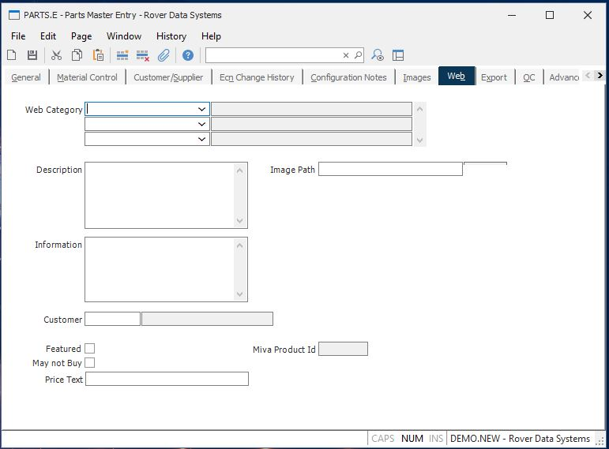

##  Parts Master Entry (PARTS.E)

<PageHeader />

##  Web

**Web Category** Enter the web category that the part number will be
associated with. When a category is selected from the web site all part
numbers that reference it will be diplayed.  
  
**Web Category Description** Displays the description of the associated web
category.  
  
**Web Description** Enter the description that is to appear for the part
number on the web page. If this field is blank the standard description for
the part will be used.  
  
**Web Information** Enter any information about the part that is to appear on
the web page when the user requests more detail about the item.  
  
**Web Customer** In some cases you may have part numbers that are specific to
a single customer and should only appear on the web store when that customer
is logged in. Specifying a customer number in this field will prevent the part
from appearing on the web store unless that customer is logged in.  
  
**Web Customer Name** Displays the name associated with the customer number
defined.  
  
**Web Featured** Check this box if the part is to be included in the list of
featured products that appears on the welcome page of the web store. The
configuration settings for the web store will determine how many items, if
any, are displayed at one time, if only items flagged are to be included or if
all items are included.  
  
**May not Buy** Check this box if the web site user is to be prevented from
adding the part to the shopping cart. This is used in cases where the part is
being promoted on the web site but must be purchased through other channels.  
  
**Price Text** In some cases you may not want the price to be displayed on the
web site until the customer adds it to their shopping cart. The text entered
in this field will be displayed in place of the price. Leave this field blank
if the price is to be shown in the regular item lists.  
  
**Web Image Path** Enter the path name to the image that is to be displayed on the web page. The web site doesn't actually use the image in this location because it maintains the images directly on the web server for efficiency, only the name is associated with the part and it must be the same as the name of the image on the web server. Your choices may be limited to a certain path based on settings in the [ WEB.CONTROL ](WEB-CONTROL/README.md) procedure.   
  
**Web Image** Web Image.  
  
**Browse** Click this button to browse for the image to be used for the part
on the web site.  
  
  
<badge text= "Version 8.10.57" vertical="middle" />

<PageFooter />