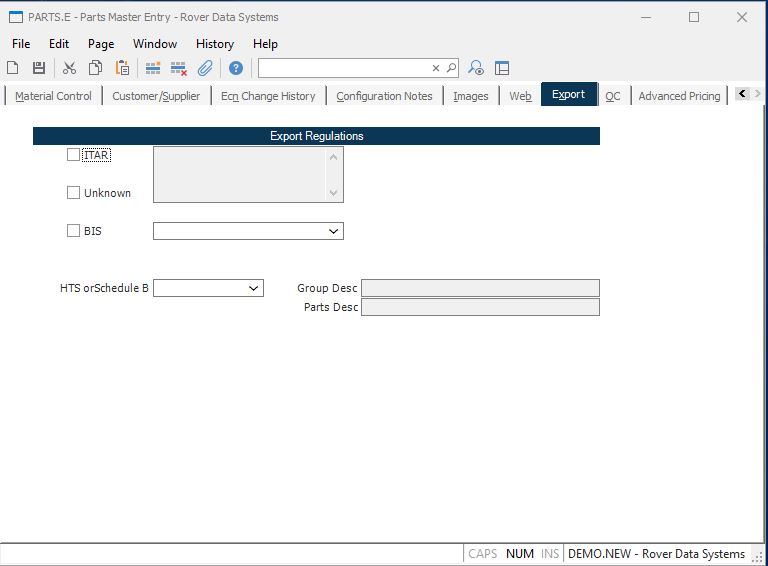

##  Parts Master Entry (PARTS.E)

<PageHeader />

##  Export

**ITAR** Check this box if the part is subject to ITAR regulations.  
  
**Unknown** Check this box if the part's export regulations are unknown. This
is the default.  
  
**BIS** Check this box if the part is subject to BIS regulations.  
  
**ITAR Msg**  
  
**Hts Schedb** Select the Schedule B that applies to this part.  
  
**Sch B Group Desc** The group description associated with the HTS or Schedule
B.  
  
**Sch B Parts Desc** The description of the parts associated with the HTS or
Schedule B.  
  
**BIS.License**  
  
  
<badge text= "Version 8.10.57" vertical="middle" />

<PageFooter />