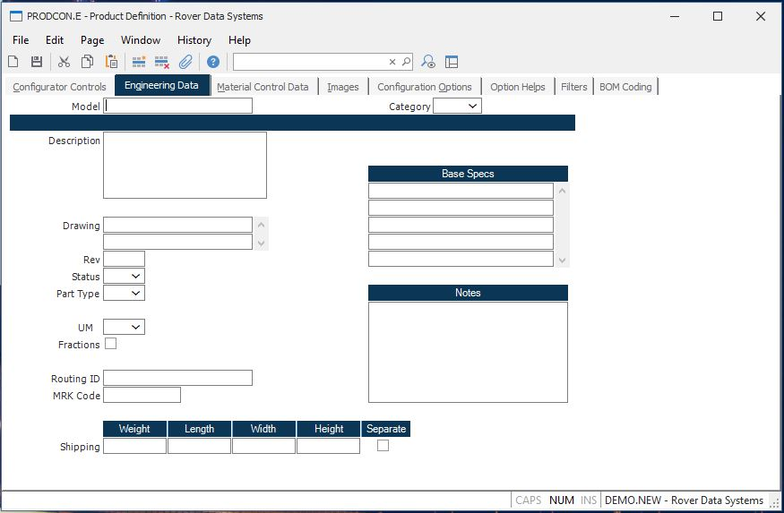

##  Product Definition (PRODCON.E)

<PageHeader />

##  Engineering Data

**Model** Enter the model number associated with the product being defined.
The entry in this field will be stored in the Model Number field of the Parts
Master records created when an item is configured. The system will default the
Configuration ID for new records.  
  
**Category** Enter the category code to be assigned to the configured parts.  
  
**Description** Enter the description of the product defined by the record.
This will be used as the first part of the description in the Parts Master
records created when items are configured. Multiple lines may be entered.  
  
**Drawing** Enter the drawing number, if any, to be associated with part
master records created by the configuration process.  
  
**Rev** Enter the revision to be assigned to the part numbers configured.  
  
**Status** Enter one of the following codes to be used as the status of the
configured parts.  
P - Preliminary (awaiting approval)  
A - Approved for use  
C - Change in process  
I - Inactive  
D - Set for  
  
**Part Type** Enter the part type to be assigned to the part numbers
configured.  
A - Assembly  
P - Phantom Assembly (not assembled)  
C - Component  
L - Line  
  
**UM** Enter the unit of measure code to be used for the product.  
  
**Fractions** Check this box if fractional quantities may be maintained in
inventory for the configured parts.  
  
**Routing ID** Enter the routing ID (if any) to be used by the configured
assemblies. You do not need a routing unless the configured parts need to be
assembled via a work order. If you specified to create a routing, this routing
will be the base routing used to add hours to the operations specified in the
configuration options.  
  
**MRK Code** Enter the marketing code to be included on any part numbers
generated as a result of using the configuration.  
  
**Weight** Enter the weight to be associated with this configuration.  
  
**Ship Length** Enter the shipping length of the part.  
  
**Ship Width** Enter the shipping width of the part.  
  
**Ship Height** Enter the shipping height of the part.  
  
**Base Specs** Enter all of the specifications associated with the base
product. These entries plus the specs for each option selected will be stored
in the configured part.  
  
**Notes** Enter any applicable notes regarding the product. These will be
stored in the notes field of each configured part number.  
  
  
<badge text= "Version 8.10.57" vertical="middle" />

<PageFooter />