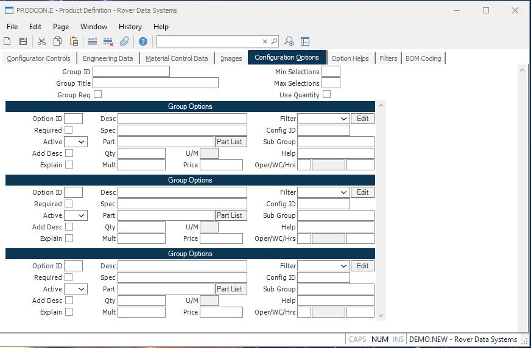

##  Product Definition (PRODCON.E)

<PageHeader />

##  Configuration Options

**Group ID** Enter the identification of the associated group of options. This
can be a meaningful name or simply a number. The first group defined will be
used as the first group in the configuration process. Other groups you define
may be called by the main or lower level groups, and may be entered here in
any sequence desired.  
  
**Group Title** Enter a title which describes the set of options to be
selected from the group. This title is displayed with the options in the
configuration procedure.  
  
**Group Required** Check this box if the associated group is a required
selection in the configurator regardless of the requirements of its parent
option.  
  
**Min Selections** Enter the minimum number of selections which must be made
from the available options.  
  
**Max Selections** Enter the maximum number of options which may be selected.  
  
**Use Quantity** Check this box if you want the minimum and maximum selection
parameters to be applied to the sum of the quantities selected, instead of the
number of selections made.  
  
**Option ID** Enter the ID for each of the associated options. These may be
meaningful combinations of letters and numbers, or simply sequential numbers.
The user can select an option by entering the ID. The help options for this
prompt include the ability to enter program code that can be used to determine
if an option is allowed based on other options (specifications) that have
already been selected.  
  
**Required** Check this box if the user is required to select the associated
sub-option list during the configuration process.  
  
**Active** Enter the letter "Y" if the associated option is to be displayed in the configurator. Setting this field to "N" allows you to remove options that were once valid from the configuration process, while maintaining the structure of the definition record. You may also set the value to "E" which indicates expert mode, allowing users of [ PRODCON.E2 ](../../../../../rover/ENG-OVERVIEW/ENG-ENTRY/PRODCON-E/PRODCON-E2) to have access to these options.   
  
**Add Desc** Check this box if you want the description of the associated
option to be added to the parts master description if it is selected.  
  
**Explain** Check this box if an explanation is to be entered by the user when
the associated option is selected.  
  
**Option Desc** Enter a description of the associated option. The description
for each option chosen is added to the description field in the Parts Master
for the configured item. In cases where the quantity is variable and you want
to include it in the description you may insert the characters ~Q in the text.
The system will replace these characters with the quantity specified when
creating the part description.  
  
**Spec** Enter the specification code (if any) associated with the option.
This will be added to the Specs field in the Parts Master for the configured
item if it is selected.  
  
**Part ID** If the option indicates the inclusion of a part number in the
configuration then you should specify the part number to be used in this
field. The part will be included in the Bill of Material created for the
configured item.  
  
**Quantity** Specify the quantity to be used when the option is selected. If a
part number is present this becomes the quantity on the bill of material for
the part. You may also allow the user to specify the quantity during the
configuration. This is done by defining the range allowed, for example, 2-5
would allow an entry of any integer between 2 and five, 2- would allow any
integer greater than or equal to 2. You specify the ability to enter decimal
quantities by entering your range with a decimal point in the number with up
to 2 decimal places. 2.00-3.50 allows the entry of any number between 2 and
3.5 with up to two decimal places. You may also require that the quantity
entered be in a specified multiple. For example, if the user was required to
enter a number that was evenly divisible by 2 for a range between 2 and 78 you
would enter 2-78/2.  
  
**Multiplier** Normally the quantity defined for the item, or entered by the
user, is passed as the multiplier to the next level selection and if the
quantity is zero or null the number one is used as the multiplier. This field
allows you to set the multiplier to a different value than what is defined by
the quantity. If the quantity is to be used as the multiplier then leave this
field blank.  
  
**U/M** Contains the bill of material unit of measure for the associated part
number. It is shown here for reference only and may not be changed.  
  
**Option Price** Enter the price, if any, for the option. The sum of the base
price plus all of the selected option prices will become the unit price of a
configured item. If a quantity is present for the option then the price
entered is multiplied by the quantity, otherwise the amount is assumed to
cover the entire price of the option. If you leave this field blank and a part
number has been entered, the system will use the price from the price file, if
present, for the associated part. If you do not want any price to be added
then enter zero. This will prevent the use of the price file.  
  
**Routing Oper** If a routing is to be created and the option will add hours
to the routing, then enter the operation number that will have the hours
applied. A help option is included to display and choose the operations of the
base routing.  
  
**Work Center** This is the work center associated to the operation number of
the routing. It is displayed for information only.  
  
**Run Hours** If a routing is to be created and the option will add hours to
the routing, then enter the number of hours to be added to the operation
specified.  
  
**Config ID** If you want the selection of the associated option to trigger
the addition of a string of characters to the configuration ID, then enter the
characters to be added at this prompt. You may include the quantity selected
for the associated by imbedding ~Q within the string which will be replaced by
the quantity for the selection. You may also specify ~C to load the
comfiguration id for the part number associated with the selection. This is
useful in cases where a sub configuration is specified and you want the
resulting configuration code included in the parent level configuration code.  
  
**Sub Group ID** If the associated option is supposed to present another set
of options to the user when selected, then enter the identification of the
group to be presented.  
  
**Help Name** If help text is to be available for the associated option, then
enter the name of the help item as defined on the screen 5.  
  
  
<badge text= "Version 8.10.57" vertical="middle" />

<PageFooter />