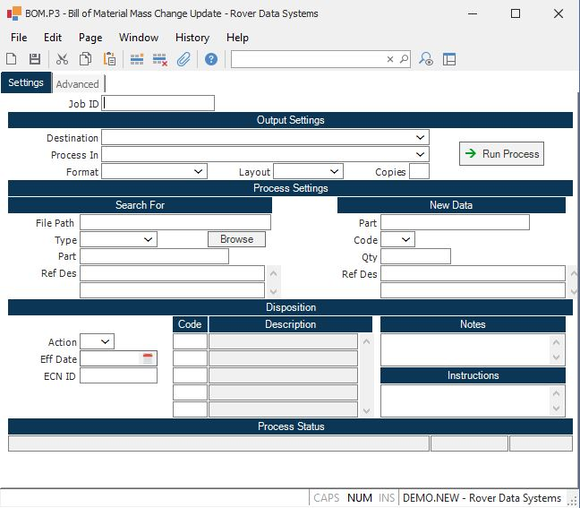

##  Bill of Material Mass Change Update (BOM.P3)

<PageHeader />

##

**Job ID** Enter a unique ID if you wish to enter and save the parameters to
this procedure for future use. If you only need to run the procedure and do
not want to save your entry then you may leave this field empty.  
  
**Destination** Select the destination for the output from this procedure.  
  
**Process** Select the method to be used for processing the report. Foreground
is always available and must be used when output is directed to anything other
than a system printer (i.e. printers spooled through the database on the host
computer.) Depending on your setup there may be various batch process queues
available in the list that allow you to submit the job for processing in the
background or at a predefined time such as overnight. A system printer must be
specified when using these queues.  
  
**Format** Select the format for the output. The availability of other formats
depends on what is allowed by each procedure. Possible formats include Text,
Excel, Word, PDF, HTML, Comma delimited and Tab delimited.  
  
**Layout** You may indicate the layout of the printed page by specifying the
appropriate setting in this field. Set the value to Portrait if the page is to
be oriented with the shorter dimension (usually 8.5 inches) at the top or
Landscape if the longer dimension (usually 11 inches) is to be at the top.
Portrait will always be available but Landscape is dependent on the output
destination and may not be available in all cases.  
  
**Copies** Enter the number of copies to be printed.  
  
**Run Process** Click on the button to run the process. This performs the save
function which may also be activated by clicking the save button in the tool
bar or pressing the F9 key or Ctrl+S.  
  
**Save List Name** You may limit the bills of material that are included in
the update by entering the name of a saved-list containing only the part
numbers you want to include.  
  
**Part Number** If you want to list the bills of material that contain a
specific part number, then enter the part number in this field. If you also
enter a reference designator, then both items must appear on the same line
item of the bill of material to be included in the report.  
  
**Reference Designator** If you want to display the bill of materials that
contain a specific reference designator, then enter the reference designator
in this field. If you also entered a part number, the part number and
reference designator must appear on the same line item of the bill of material
to be included in the report.  
  
**Part Number** If you want the part number to be different from the part
number of the old item, then enter the new part number in this field. If left
blank, the old part number will be used.  
  
**Code** If you want the new item to contain a different part code than the
original item, then enter it in this field. Valid entries are:  
  
A - Assembly  
C - Component  
P - Phantom  
L - Line Stock  
If left blank the code from the original item will be used.  
  
**Quantity** If you want the quantity to be changed from the original item,
enter the new quantity in this field. If left blank the quantity from the
original item will be used.  
  
**Reference Designator** If you want the reference designator to be different
from the original item, then enter the new information in this field. If left
blank, the original reference designator will be used.  
  
**Action** Enter one of the following codes that defines the action to be
taken for the items selected for change.  
  
A - Add a new item to the bill of material  
without changing the original item.  
C - Change the item selected with the new  
information defined.  
D - Delete the item selected from the bill of  
material.  
I - Phase in the new item by adding it to the  
bill of material, and setting the end  
effectivity date on the old item, and the  
start effectivity date on the new item to  
the date you specify.  
O - Phase out the existing item by setting its  
end effectivity date as specified.  
  
**Effective Date** If you have chosen action "I" (Phase-in), then enter the
date on which the new item is to become effective, and the old item is to end
effectivity.  
  
**ECN.ID** If this change is associated with an existing Engineering Change Notice, then you may specify the ECN number in this field. If a valid ECN number is entered, this procedure will not make the changes to the bills of material directly. It will instead load the assembly numbers matching the selection criteria, and the proposed changes into the ECN record. You may then adjust these entries with [ ECN.E ](../../../ENG-ENTRY/ECN-E/README.md) if desired, and use the [ ECN.P1 ](../../ECN-P1/README.md) procedure to actually post the updates. If an ECN number is not specified, this procedure will make the changes directly to the bills of material.   
  
**Last Status Message** Contains the last status message generated by the
program.  
  
**Last Status Date** The date on which the last status message was generated.  
  
**Last Status Time** The time at which the last status message was generated.  
  
**Disposition Code** Enter the disposition codes to be included on the ECN for
each part number loaded. This only applies if an ECN number was entered.  
  
**Disposition Description** Displays the description of the associated
disposition.  
  
**Disposition Notes** Enter the disposition notes to be included on the ECN
for each part number loaded. This only applies if an ECN number was entered.  
  
**Disposition Instructions** Enter the disposition instructions to be included
on the ECN for each part number loaded. This only applies if an ECN number was
entered.  
  
  
<badge text= "Version 8.10.57" vertical="middle" />

<PageFooter />