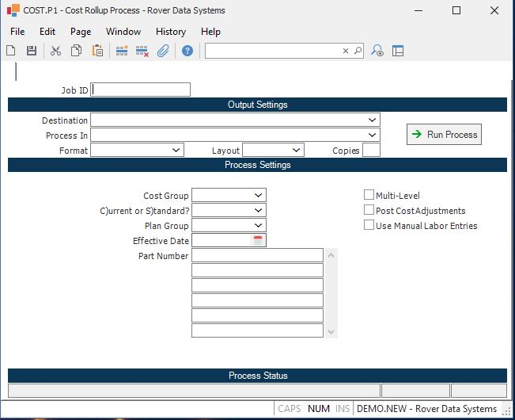

##  Cost Rollup Process (COST.P1)

<PageHeader />

##

**Job ID** Enter a unique ID if you wish to enter and save the parameters to
this procedure for future use. If you only need to run the procedure and do
not want to save your entry then you may leave this field empty.  
  
**Destination** Select the destination for the output from this procedure.  
  
**Process** Select the method to be used for processing the report. Foreground
is always available and must be used when output is directed to anything other
than a system printer (i.e. printers spooled through the database on the host
computer.) Depending on your setup there may be various batch process queues
available in the list that allow you to submit the job for processing in the
background or at a predefined time such as overnight. A system printer must be
specified when using these queues.  
  
**Format** Select the format for the output. The availability of other formats
depends on what is allowed by each procedure. Possible formats include Text,
Excel, Word, PDF, HTML, Comma delimited and Tab delimited.  
  
**Layout** You may indicate the layout of the printed page by specifying the
appropriate setting in this field. Set the value to Portrait if the page is to
be oriented with the shorter dimension (usually 8.5 inches) at the top or
Landscape if the longer dimension (usually 11 inches) is to be at the top.
Portrait will always be available but Landscape is dependent on the output
destination and may not be available in all cases.  
  
**Copies** Enter the number of copies to be printed.  
  
**Run Process** Click on the button to run the process. This performs the save
function which may also be activated by clicking the save button in the tool
bar or pressing the F9 key or Ctrl+S.  
  
**Cost Group** Enter the cost group which will be validated against [ INV.CONTROL ](../../../../../../../../../../rover/AP-OVERVIEW/AP-ENTRY/AP-E/AP-E-2/INV-CONTROL) . The cost group is used to define the costing method and to group inventory locations together for averaging the cost within those locations.   
  
**Current or Standard Cost** You have the option of rolling up either the
current costs or the standard (book) costs. In the normal flow of operations
you would rollup only current costs and then use the cost rollover procedure
to move those costs to the standard fields when appropriate. Rolling up the
standard cost fields is generally done only when a new item is added to the
product line and production on the item is to begin prior to the next formal
cost rollover.  
  
**Plan Group** Enter the planning group that should be used in this process. This procedures uses the routing and make/buy code entered in [ PARTS.E ](../../../../../../../../../../rover/AP-OVERVIEW/AP-ENTRY/ACCT-CONTROL/ACCT-CONTROL-1/ar-e/PARTS-E) to calculate the labor and material that should be applied to this part. These fields are defined by planning group in [ PARTS.E ](../../../../../../../../../../rover/AP-OVERVIEW/AP-ENTRY/ACCT-CONTROL/ACCT-CONTROL-1/ar-e/PARTS-E) . Therefore, if more than one planning group has been set-up for this account, the program needs to know which planning group should be used in this procedure. If no entry has been made into this field, COST.P1 will use the data associated to the first planning group entered into [ PARTS.E ](../../../../../../../../../../rover/AP-OVERVIEW/AP-ENTRY/ACCT-CONTROL/ACCT-CONTROL-1/ar-e/PARTS-E) .   
  
**Effective Date** Enter the date to be used for the bill of material
effectivity date. Bill of material line items will be included or excluded
based on the start and end effectivity dates for each item relative to the
date entered.  
  
**Part Number** If you want to rollup all of the part numbers then leave this
field blank. If you want to rollup specific assemblies then enter the part
numbers of those items in this field. If the assembly has subassemblies, be
sure to check the multi-level rollup option to include costs for the entire
BOM structure.  
  
**Multi-level?** If the cost rollup is being done for a specific assembly part
number and you want a multi-level cost rollup, then check this box. If a
rollup is being done for all part numbers, then this doesn't apply since it
will already be doing a multi-level rollup.  
  
**Cost Adj** Check this box if the adjustments resulting from the cost rollup
process are to be posted to the inventory register. Otherwise leave unchecked.
This option is only valid when rolling up standard cost group.  
  
**Last Status Message** Contains the last status message generated by the
program.  
  
**Last Status Date** The date on which the last status message was generated.  
  
**Last Status Time** The time at which the last status message was generated.  
  
**Use Manual Labor Entries** Check this box if you wish to include the labor amount entered in [ COST.E ](../../../../../../../../../../rover/AP-OVERVIEW/AP-ENTRY/AP-E/AP-E-2/INV-CONTROL/INV-CONTROL-1/COST-P2/COST-P1/COST-E) in the rollup. Please note, that this option will only apply if a routing is not found for the part. If a routing is found, the labor amount will be based on the routing and the manual entry made in [ COST.E ](../../../../../../../../../../rover/AP-OVERVIEW/AP-ENTRY/AP-E/AP-E-2/INV-CONTROL/INV-CONTROL-1/COST-P2/COST-P1/COST-E) will be replaced with the calculated amount. Also, if this box is not checked and no routing is found for the part, the labor amount entered in [ COST.E ](../../../../../../../../../../rover/AP-OVERVIEW/AP-ENTRY/AP-E/AP-E-2/INV-CONTROL/INV-CONTROL-1/COST-P2/COST-P1/COST-E) will be deleted and the labor will not be included in the rollup.   
  
  
<badge text= "Version 8.10.57" vertical="middle" />

<PageFooter />