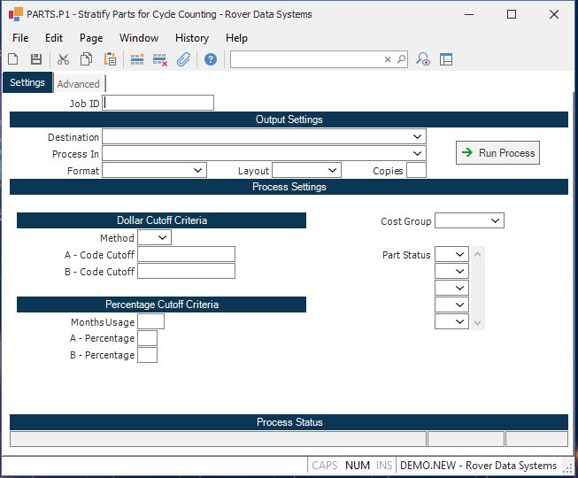

##  Stratify Parts for Cycle Counting (PARTS.P1)

<PageHeader />

##

**Job ID** Enter a unique ID if you wish to enter and save the parameters to
this procedure for future use. If you only need to run the procedure and do
not want to save your entry then you may leave this field empty.  
  
**Destination** Select the destination for the output from this procedure.  
  
**Process** Select the method to be used for processing the report. Foreground
is always available and must be used when output is directed to anything other
than a system printer (i.e. printers spooled through the database on the host
computer.) Depending on your setup there may be various batch process queues
available in the list that allow you to submit the job for processing in the
background or at a predefined time such as overnight. A system printer must be
specified when using these queues.  
  
**Format** Select the format for the output. The availability of other formats
depends on what is allowed by each procedure. Possible formats include Text,
Excel, Word, PDF, HTML, Comma delimited and Tab delimited.  
  
**Layout** You may indicate the layout of the printed page by specifying the
appropriate setting in this field. Set the value to Portrait if the page is to
be oriented with the shorter dimension (usually 8.5 inches) at the top or
Landscape if the longer dimension (usually 11 inches) is to be at the top.
Portrait will always be available but Landscape is dependent on the output
destination and may not be available in all cases.  
  
**Copies** Enter the number of copies to be printed.  
  
**Run Process** Click on the button to run the process. This performs the save
function which may also be activated by clicking the save button in the tool
bar or pressing the F9 key or Ctrl+S.  
  
**Method** Enter "1" to use part cost only to rank the parts. Enter "2" to use
part cost X average usage to rank the parts.  
  
**"A" Code Cutoff** Enter the unit cost to be used to identify the "A" parts.
For example, if you wish to make any parts with a unit cost of $1000 or more
an "A" part, enter 10000.  
  
**"B" Code Cutoff** Enter the unit cost to be used to identify the "B" parts.
For example, if you wish to make any parts with a unit cost of $250 or more an
"B" part, enter 250.  
  
**Months Usage** Enter the number of months usage to include as part of the
calculation. This, along with unit cost will determine the ranking of the
part.  
  
**"A" Percentage Cutoff** Enter the percentage of parts that should become
"A". For example, if you enter 20, then the top 20% of parts ranked by usage &
cost will become "A" parts.  
  
**"B" Percentage Cutoff** Enter the percentage of parts that should become
"B". For example, if you enter 30, then 30% of parts ranked by usage & cost
after "A" parts will become "B" parts. The rest will become "C" parts.  
  
**Cost Group** Enter the cost group which will be validated against [ INV.CONTROL ](../../../../INV-OVERVIEW/INV-ENTRY/INV-CONTROL/README.md) . The cost group is used to define the costing method and will be used to determine which unit cost to use in the stratification process.   
  
**Part Status** If you want to limit the part population to include only
certain part statuses, enter them here.  
  
P - Preliminary  
A - Approved  
C - Change in process  
I - Inactive  
D - Set for  
  
**Last Status Message** Contains the last status message generated by the
program.  
  
**Last Status Date** The date on which the last status message was generated.  
  
**Last Status Time** The time at which the last status message was generated.  
  
  
<badge text= "Version 8.10.57" vertical="middle" />

<PageFooter />