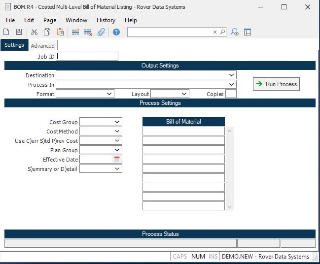

##  Costed Multi-Level Bill of Material Listing (BOM.R4)

<PageHeader />

##

**Job ID** Enter a unique ID if you wish to enter and save the parameters to
this procedure for future use. If you only need to run the procedure and do
not want to save your entry then you may leave this field empty.  
  
**Destination** Select the destination for the output from this procedure.  
  
**Process** Select the method to be used for processing the report. Foreground
is always available and must be used when output is directed to anything other
than a system printer (i.e. printers spooled through the database on the host
computer.) Depending on your setup there may be various batch process queues
available in the list that allow you to submit the job for processing in the
background or at a predefined time such as overnight. A system printer must be
specified when using these queues.  
  
**Format** Select the format for the output. The availability of other formats
depends on what is allowed by each procedure. Possible formats include Text,
Excel, Word, PDF, HTML, Comma delimited and Tab delimited.  
  
**Layout** You may indicate the layout of the printed page by specifying the
appropriate setting in this field. Set the value to Portrait if the page is to
be oriented with the shorter dimension (usually 8.5 inches) at the top or
Landscape if the longer dimension (usually 11 inches) is to be at the top.
Portrait will always be available but Landscape is dependent on the output
destination and may not be available in all cases.  
  
**Copies** Enter the number of copies to be printed.  
  
**Run Process** Click on the button to run the process. This performs the save
function which may also be activated by clicking the save button in the tool
bar or pressing the F9 key or Ctrl+S.  
  
**Cost Group** Enter the cost group which will be validated against [ INV.CONTROL ](../../../../../rover/AP-OVERVIEW/AP-ENTRY/AP-E/AP-E-2/INV-CONTROL) . The cost method assigned to the cost group will default into the subsequent entry for cost method. The cost group is used to retrieve the correct unit cost from the COST and inventory records.   
  
**Cost Method** Enter the letter "A" if you want to use the current average material cost for component parts Enter "S" for standard cost. If average is selected and there is no average cost found for a given part number and cost group then the standard cost will be used. An asterisk (*) next to the unit cost will denote that the standard cost was used. If you do not specify a cost type in this field then the standard cost will be used. The cost method will be defaulted into this field from the cost method defined in the [ INV.CONTROL ](../../../../../rover/AP-OVERVIEW/AP-ENTRY/AP-E/AP-E-2/INV-CONTROL) procedure for the cost group entered previously. If lot costing is selected then lot cost will be used for all lot controlled parts and average cost will be used for non-lot controlled parts.   
  
**Use C)urr S)td P)rev Cost** Enter one of the following codes which
determines which set of standard costs are to be used in the listing.  
C - Current Costs  
S - Standard Costs  
P - Previous Costs  
If left blank then "S" is assumed.  
  
**Plan Group** Enter the planning group that should be used in this report. Enter the planning group that should be used in this process. This entry is required to determine the make/buy status of the part. If no entry is made into this field, the report will used the first planning group that has been entered into [ parts.e ](../../../../../rover/AP-OVERVIEW/AP-ENTRY/AP-E/AP-E-1/CURRENCY-CONTROL/PO-E/PO-E-1/po-control/PO-CONTROL-1/parts-e) . If you wish to to match this report to the costs appearing in [ COST.E ](../../../../../rover/AP-OVERVIEW/AP-ENTRY/AP-E/AP-E-2/INV-CONTROL/INV-CONTROL-1/COST-P2/COST-P1/COST-E) , you will need to use the same planning group that was used in the cost rollup procedure, [ COST.P1 ](../../../../../rover/AP-OVERVIEW/AP-ENTRY/AP-E/AP-E-2/INV-CONTROL/INV-CONTROL-1/COST-P2/COST-P1) .   
  
**C$X64** Enter the date to use in determining which items on the bills of
material are to be included in the listing. The start and end effectivity
dates on the bills of material are compared with the date entered.  
  
**S)ummary or D)etail** Enter the letter "D" if you want to include the detail
data for each part number. Enter "S" to show the summary totals only.  
  
**Bill of Material Numbers** Enter all of the bill of materials you want to
have printed or displayed. You may also enter a model number, category or
manufacturer part.  
  
**Last Status Message** Contains the last status message generated by the
program.  
  
**Last Status Date** The date on which the last status message was generated.  
  
**Last Status Time** The time at which the last status message was generated.  
  
**Print All Bom's** Check this box if you wish to print all bills of material.
After returning through this field, the bills of material will be loaded into
the BILL OF MATERIAL field for you so that you can remove the items you do not
wish to include.  
  
  
<badge text= "Version 8.10.57" vertical="middle" />

<PageFooter />