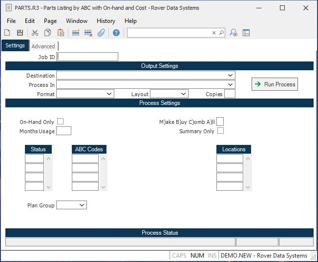

##  Parts Listing by ABC with On-hand and Cost (PARTS.R3)

<PageHeader />

##

**Job ID** Enter a unique ID if you wish to enter and save the parameters to
this procedure for future use. If you only need to run the procedure and do
not want to save your entry then you may leave this field empty.  
  
**Destination** Select the destination for the output from this procedure.  
  
**Process** Select the method to be used for processing the report. Foreground
is always available and must be used when output is directed to anything other
than a system printer (i.e. printers spooled through the database on the host
computer.) Depending on your setup there may be various batch process queues
available in the list that allow you to submit the job for processing in the
background or at a predefined time such as overnight. A system printer must be
specified when using these queues.  
  
**Format** Select the format for the output. The availability of other formats
depends on what is allowed by each procedure. Possible formats include Text,
Excel, Word, PDF, HTML, Comma delimited and Tab delimited.  
  
**Layout** You may indicate the layout of the printed page by specifying the
appropriate setting in this field. Set the value to Portrait if the page is to
be oriented with the shorter dimension (usually 8.5 inches) at the top or
Landscape if the longer dimension (usually 11 inches) is to be at the top.
Portrait will always be available but Landscape is dependent on the output
destination and may not be available in all cases.  
  
**Copies** Enter the number of copies to be printed.  
  
**Run Process** Click on the button to run the process. This performs the save
function which may also be activated by clicking the save button in the tool
bar or pressing the F9 key or Ctrl+S.  
  
**On Hand Only** Check this box to show only parts with on-hand quantity in
inventory.  
  
**Months Usage** Enter the number of months usage to show in the report.  
  
**Part Status** If you want to limit the part population to include only
certain part statuses, enter them here. See help for valid values.  
  
**ABC Codes** You may limit the listing to include only selected ABC codes. If
you want to list all parts, then leave this field blank.  
  
**Plan Group** Enter the name of the planning group that will apply for the
make/buy flag.  
  
**M)ake B)uy C)omb A)ll** Enter one of the following letters which defines
which types of parts are to be included in the listing...  
M - Make parts only  
B - Buy parts only  
C - Combination make/buy  
A - All parts If no selection is entered then "A" is assumed. Also, any part
that is not defined as either make, buy or combination will be included.  
  
**Summary Only** Enter a "Y" to print only a summary page. Enter an "N" to
print all detail with totals. Detail report is the default if nothing is
entered.  
  
**Location** Enter the locations you want to use for selecting the parts. Only
those parts with on-hand in these locations will be included. Leave blank to
not use location as a selection criteria.  
  
**Last Status Message** Contains the last status message generated by the
program.  
  
**Last Status Date** The date on which the last status message was generated.  
  
**Last Status Time** The time at which the last status message was generated.  
  
  
<badge text= "Version 8.10.57" vertical="middle" />

<PageFooter />