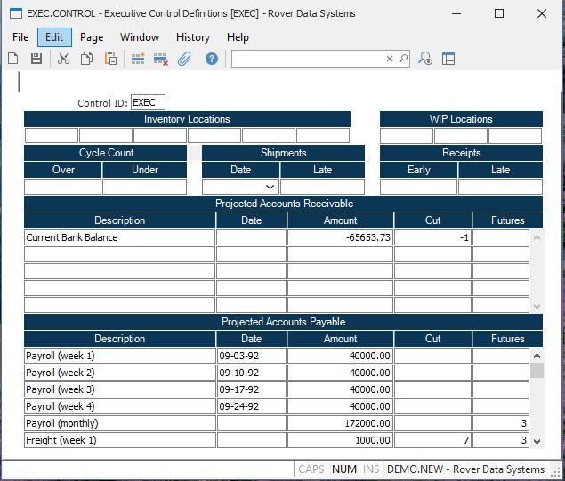

##  Executive Control Definitions (EXEC.CONTROL)

<PageHeader />

##

**Control ID** The record ID for the EXEC.CONTROL record is EXEC. It is loaded
automatically by the system, and is the only record accessible by this
procedure.  
  
**Finished Goods Locations** Enter all finished goods inventory locations for
which you wish to capture information for the Executive Inquiry.  
  
**Stock Locations** Enter all stocking inventory locations for which you wish
to capture information for the Executive Inquiry.  
  
**Work in Process Locations** Enter all work in process locations for which
you wish to capture information for the Executive Inquiry.  
  
**Cycle Count Tolerance** Enter the tolerance percent for cycle count tags.  
  
**Cycle Count Tolerance** Enter the tolerance percent for cycle count tags.  
  
**Ship Tolerance** Enter the tolerance percent for on-time shipments.  
  
**Ship Tolerance** Enter the tolerance percent for on-time shipments.  
  
**Receipts Tolerance** Enter the tolerance percent for on-time receipts.  
  
**Receipts Tolerance** Enter the tolerance percent for on-time receipts.  
  
**Projected AR Desc** Enter the description of the projected AR amount.  
  
**Projected AR Date** Enter the date on which the projected AR is due. The
amount associated with this date will be added to the projected accounts
receivable until the date is past due. If this field is left blank the
assocaiated amount will be added into each of the projected aging fields.  
  
**Projected AR Amount** Enter the amount of the projected AR item.  
  
**Cutoff** Enter the last day on which the corresponding entry will be
considered in the current period. This is normally the last day before the
amount will become an accounts receivable and no longer should be considered
in the projected figures. An entry of 0 will indicate that the amount will be
included for the entire current period. A null entry will indicate that the
amount should be included in all periods except for the past due and current
periods. An entry of -1 will indicate that the amount should appear only in
the past due period.  
  
**Futures** Enter the number of times this amount is added into the future
period. In essence, this field controls the number of future periods which are
considered.  
  
**Projected AP Desc** Enter the description of the projected AP amount.  
  
**Projected AP Date** Enter the date on which the projected AP is due. The
amount associated with the date will be included in the projected accounts
payable until the date is past due. If this field is left blank the
assocaiated amount will be added into each of the projected aging fields.  
  
**Projected AP Amount** Enter the amount of the projected AP item.  
  
**Cutoff** Enter the last day on which the corresponding entry will be
considered in the current period. This is normally the last day before the
amount will become an accounts payable item and no longer should be considered
in the projected figures. An entry of 0 will indicate that the amount will be
included for the entire current period. A null entry will indicate that the
amount should be included in all periods except for the past due and current
periods. An entry of -1 will indicate that the amount should appear only in
the past due period.  
  
**Futures** Enter the number of times this amount is added into the future
period. In essence, this field controls the number of future periods which are
considered.  
  
  
<badge text= "Version 8.10.57" vertical="middle" />

<PageFooter />