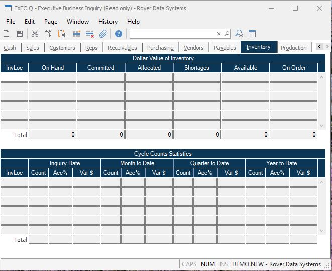

##  Executive Business Inquiry (EXEC.Q)

<PageHeader />

##  Inventory

**Invloc** Displays all of the inventory locations for which there is a
current balance or pending activity.  
  
**On Hand** The dollar value of inventory on hand at each of the associated
locations.  
  
**Committed** The dollar value of inventory committed at each of the
associated locations.  
  
**Allocated** The dollar value of inventory allocated at each of the
associated locations.  
  
**Shortages** The dollar value of shortages at each of the associated
locations.  
  
**Available** The dollar value of available on hand at each of the associated
locations.  
  
**On Order** The dollar value of inventory on order at each of the associated
locations.  
  
**Total On Hand** The total value of on hand inventory.  
  
**Total Committed** The total value of committed inventory.  
  
**Total Allocated** The total value of allocated inventory.  
  
**Total Shortages** The total value of allocated inventory.  
  
**Total Available** The total value of available inventory.  
  
**Total On Order** The total value of items on order to inventory.  
  
**Cycle Invloc** Each of the inventory locations that had cycle count activity
during the year.  
  
**Cycle Day Count** The number of items cycle counted on the inquiry date.  
  
**Day Accuracy %** The accuracy percentage for the cycle count based on the
dollar variance.  
  
**Cycle Day Variance** The dollar variance generated as a result of the cycle
count for the inquiry date.  
  
**Cycle Mtd Count** The number of items cycle counted month to date.  
  
**MTD Accuracy %** The accuracy percentage for the cycle count based on the
dollar variance.  
  
**MTD Variance $** The dollar variance generated for cycle counts month to
date.  
  
**Cycle Qtd Count** The number of items cycle counted quarter to date.  
  
**QTD Accuracy %** The accuracy percentage for the cycle count based on the
dollar variance.  
  
**QTD Variance $** The dollar variance generated for cycle counts quarter to
date.  
  
**Cycle Ytd Count** The number of items cycle counted year to date.  
  
**YTD Accuracy %** The accuracy percentage for the cycle count based on the
dollar variance.  
  
**YTD Variance $** The dollar variance generated for cycle counts year to
date.  
  
**Day Total Count** The total number of items (part numbers) counted for the
day.  
  
**MTD Total Count** The total number of items (part numbers) counted month to
date.  
  
**QTD Total Count** The total number of items (part numbers) counted quarter
to date.  
  
**YTD Total Count** The total number of items (part numbers) counted year to
date.  
  
**Day Total Accuracy %** The total accuracy percentage of cycle counts for the
day.  
  
**MTD Total Accuracy %** The total accuracy percentage of cycle counts month
to date.  
  
**QTD Total Accuracy %** The total accuracy percentage of cycle counts quarter
to date.  
  
**YTD Total Accuracy %** The total accuracy percentage of cycle counts year to
date.  
  
**Day Total Variance $** The total dollar variance generated by cycle counts
for the day.  
  
**MTD Total Variance $** The total dollar variance generated by cycle counts
month to date.  
  
**QTD Total Variance $** The total dollar variance generated by cycle counts
quarter to date.  
  
**YTD Total Variance $** The total dollar variance generated by cycle counts
year to date.  
  
  
<badge text= "Version 8.10.57" vertical="middle" />

<PageFooter />