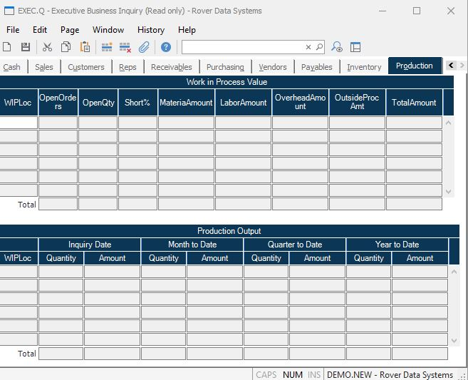

##  Executive Business Inquiry (EXEC.Q)

<PageHeader />

##  Production

**Wip Invloc** Displays each of the work in process location for which there
are work orders currently in process.  
  
**Wip Orders** Shows the number of work order currently released, pulled, or
in process for the associated location.  
  
**Wip Quantity** The number of units currently in process for the associated
location.  
  
**Wip Short Pct** The percentage of work orders that contain one or more
shortages.  
  
**Wip Matl Amt** The value of material currently in work orders associated
with the location.  
  
**Wip Labor Amt** The value of labor currently in work orders associated with
the location.  
  
**Wip Oh Amt** The value of overhead currently in work orders associated with
the location.  
  
**Wip Op Amt** The value of outside processing currently in work orders
associated with the location.  
  
**WIP Total value** The total value of material, labor, overhead and outside
processing in the associated location.  
  
**Total Orders** The total number of work orders in process for all locations.  
  
**Total Open Quantity** The total number of items in process for all
locations.  
  
**Total Percentage Short** The percentage of orders from all locations that
have one or more components short.  
  
**Total Material** The total material value for all locations.  
  
**Total Labor** The total value of labor for all locations.  
  
**Total Overhead** The total value of overhead for all locations.  
  
**Total Outside Processing** The total value of outside processing for all
locations.  
  
**Grand Total value** The total value of material, labor, overhead and outside
processing for all locations.  
  
**Wip Comp Invloc** Displays each of the work in process location for which
there were completions.  
  
**Wip Qty Comp** Displays the number of items completed in each period for the
associated work in process location.  
  
**Wip Amt Comp** Displays the dollar amount completed in each period for the
associated work in process location.  
  
**Total Quantity** Displays the total quantity completed within each period
for all wip locations.  
  
**Total Amount** Displays the total amount completed for each period for all
locations.  
  
  
<badge text= "Version 8.10.57" vertical="middle" />

<PageFooter />