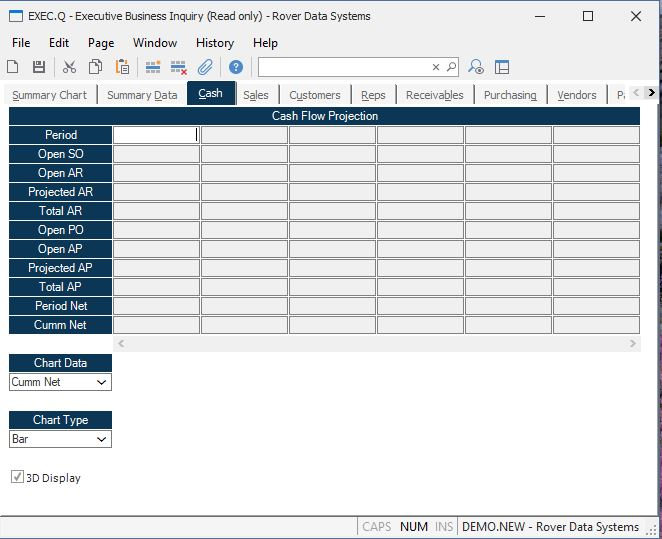

##  Executive Business Inquiry (EXEC.Q)

<PageHeader />

##  Cash

**Period Names** Contains the name of each period to which the  
dollar amounts in the various category are  
associated.  
  
**SO Backlog** Total SO backlog as calculated on the selected  
date.  
  
**Open AR** Total accounts receivable as calculated on the date selected, from
the AR file.  
  
**Projected AR** Projected accounts receivable as calculated on the  
selected date. This figure is generated from:  
1\. Sales backlog (sales orders not shipped). The  
scheduled ship date is adjusted by the net days  
found in the TERMS file.  
2\. Any recurring AR items found in the ARR file  
which have not yet been invoiced. Net days  
from the TERMS file have been applied.  
3\. Any projected AR items entered in the Control  
record with the [ EXEC.CONTROL ](../../../EXEC-ENTRY/EXEC-CONTROL/README.md) procedure.   
Any eligible items from 1. or 2. with a calculated  
date in the 'past due' column will be moved into  
the current field.  
  
**PO Commits** The total purchase order commitments, as derived  
from open PO records.  
  
**Open A/P** Total open accounts payable as calculated on the selected date,
from the AP file.  
  
**Projected AP** Total projected accounts payable as calculated on the
selected date. This figure is calculated from:  
  
1\. The open balance of purchase orders which have not yet been received. The
dates are adjusted based upon the net days found in the TERMS file  
  
2\. Any recurring AP items found in the APR file which have not yet been
invoiced.  
  
3\. Any items found in the Control record [ EXEC.CONTROL ](../../../EXEC-ENTRY/EXEC-CONTROL/README.md) .   
  
4\. Accrued accounts payable records i.e. purchase orders that have been
received but not invoiced.  
  
**Period Cash** Displays the net cash anticipated for the  
associated period.  
  
**Projected Cash** Total projected cash as calculated on the selected  
date. This figure is calculated :  
Open AR + Projected AR  
less Open AP + Projected  
  
**Total AR** The total of open accounts receivable and projected accounts
receivable for each period.  
  
**Total AP** The total of open accounts payable and projected accounts payable
for each period.  
  
**Chart Data** Select the data type to be displayed in the chart.  
  
**Chart Type** Select the chart format to be used.  
  
**3D** Check this box if the chart is to be displayed in a three dimentional
format.  
  
**Cash Flow Chart** Displays a chart of the cash flow parameters specified.  
  
  
<badge text= "Version 8.10.57" vertical="middle" />

<PageFooter />