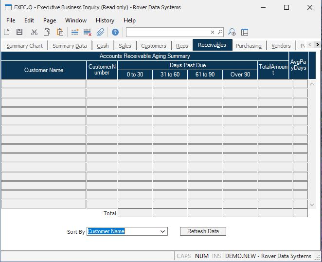

##  Executive Business Inquiry (EXEC.Q)

<PageHeader />

##  Receivables

**Sort By** Select on of the following sort sequences for displaying the
accounts receivable data  
  
Customer Name  
Descending Total Amount  
Oldest Invoice Date  
  
Then click the "Refresh Data" button to resort the data.  
  
**AR Cust Name** Displays the name of each customer for which there are open
accounts receivable records.  
  
**AR Cust No**  
  
**AR Amounts** Displays the open invoice amounts in each period for the
associated customer.  
  
**Total Customer Amount** Displays the total open accounts receivable balance
for the customer.  
  
**AR Average Days** Displays the average days it has historically taken for
the customer to pay an invoice.  
  
**0 to 30 Day Total** The total for all customer in the 0 to 30 day column.  
  
**61 to 90 Day Total** The total for all customer in the 31 to 60 day column.  
  
**61 to 90 Day Total** The total for all customer in the 61 to 90 day column.  
  
**Over 90 Day Total** The total for all customer in the over 90 day column.  
  
**Total AR** The total accounts receivable for all customers.  
  
**Refresh Data** Click this button to refresh the data based on the sort
criteria defined in the sort by field.  
  
**AR Total Avg** Displays the average number of days the elapse before an
invoice is paid based on all invoices to all customers.  
  
  
<badge text= "Version 8.10.57" vertical="middle" />

<PageFooter />