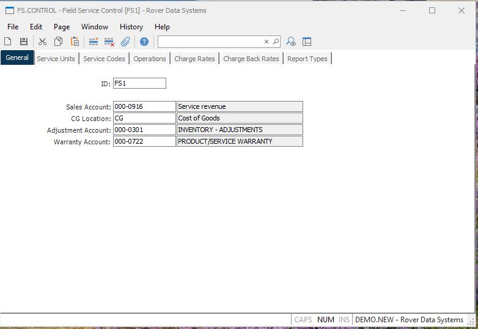

##  Field Service Control (FS.CONTROL)

<PageHeader />

##  General

**Control.ID** The control id is the company code (as defined on screen 2 of
CO.CONTROL) preceded by "FS". If you only have one company code the control id
will automatically be inserted into this procedure for you. If you have
multiple company codes you may select from a list of available companies or
you may enter the id directly e.g. FS1. This record contains the default
information used in the FS module by company code.  
  
**Sales Account** Enter the sales account to be used as the default in service
orders for parts that are sold.  
  
**CG Location** Enter the cost of goods sold location to be used as the
default for parts sold through service orders.  
  
**Adjustment Account** Enter the general ledger account number to be used as
the credit account for posting materials entered on a field service order that
do not have a part number associated with them.  
  
**Warranty Account** Enter the account number to be used as the distribution
account number for debit memos created in accounts payable for warranty
reimbursement.  
  
**Sales Account Desc** Contians the description of the sales account as found
on the GL chart of accounts.  
  
**CG Location Desc** Contains the description of the CG location as found in
the inventory location file.  
  
**Adjustment Account Desc** Displays the account number description for the
adjustment account.  
  
**Warranty Acccount Desc** Displays the description of the warranty account.  
  
  
<badge text= "Version 8.10.57" vertical="middle" />

<PageFooter />