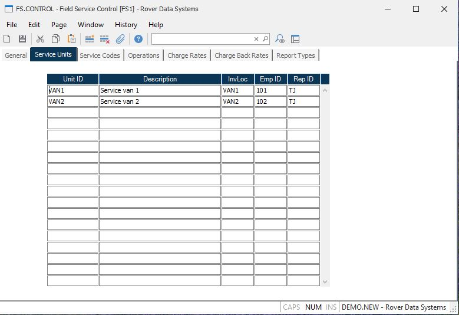

##  Field Service Control (FS.CONTROL)

<PageHeader />

##  Service Units

**Unit ID** Enter the identification of each service unit. This may be a
company van or truck, or service location.  
  
**Description** Enter a description of the associated service unit being
described.  
  
**Invloc** Enter the inventory location associated with the service unit. This
is the default location from which materials used on a service order are
drawn.  
  
**Emp ID** Enter the ID of the employee normally associated with the service
unit. This will be used as the default employee on service orders assigned to
the associated service unit.  
  
**Rep ID** Enter the identification of the rep normally associated with the
service unit. This will be used as the default rep in service orders.  
  
  
<badge text= "Version 8.10.57" vertical="middle" />

<PageFooter />