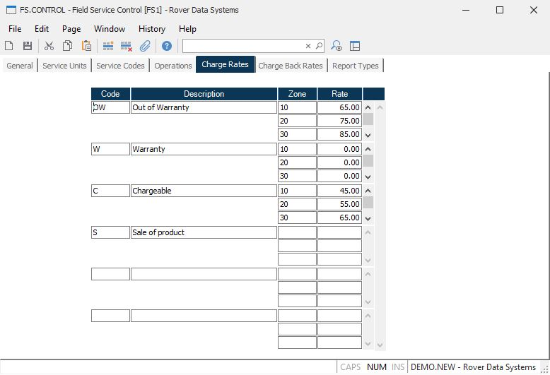

##  Field Service Control (FS.CONTROL)

<PageHeader />

##  Charge Rates

**Charge Code** Enter all of the charge codes available for use.  
  
**Charge Description** Enter the description of the associated charge code.  
  
**Zone** Enter each of the zones to define the rates to be used for the charge
code.  
  
**Rate** Enter the rate for the associated zone for the charge code.  
  
  
<badge text= "Version 8.10.57" vertical="middle" />

<PageFooter />